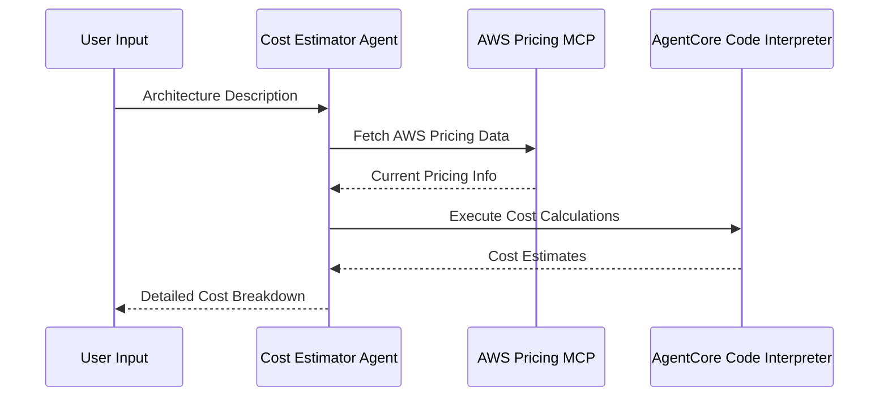

# AgentCore Code Interpreter Integration

[English](README.md) / [日本語](README_ja.md)

This implementation demonstrates **AgentCore Code Interpreter** for secure AWS cost estimation calculations. The agent combines real-time AWS pricing data with sandboxed Python execution to provide accurate cost estimates for system architectures.

## Process Overview



## Prerequisites

1. **AWS credentials** - With Bedrock access permissions
2. **Python 3.12+** - Required for async/await support
3. **Dependencies** - Installed via `uv` (see pyproject.toml)

## How to use

### File Structure

```
01_code_interpreter/
├── README.md                           # This documentation
├── cost_estimator_agent/
│   ├── __init__.py                     # Package initialization
│   ├── config.py                       # Configuration and prompts
│   └── cost_estimator_agent.py         # Main agent implementation
└── test_cost_estimator_agent.py        # Test suite
```

### Step 1: Run Basic Cost Estimation

```bash
cd 01_code_interpreter
uv run python test_cost_estimator_agent.py
```

This will test the agent with a default architecture and demonstrate both regular and streaming responses.

### Step 2: Test with Custom Architecture

```bash
cd 01_code_interpreter
uv run python test_cost_estimator_agent.py --architecture "Two EC2 m5.large instances with RDS MySQL"
```

### Step 3: Test Specific Functionality

```bash
# Test only streaming responses
cd 01_code_interpreter
uv run python test_cost_estimator_agent.py --tests streaming

# Test only regular responses
cd 01_code_interpreter
uv run python test_cost_estimator_agent.py --tests regular
```

## Key Implementation Pattern

### AgentCore Code Interpreter Setup

```python
from bedrock_agentcore.tools.code_interpreter_client import CodeInterpreter

def _setup_code_interpreter(self) -> None:
    """Setup AgentCore Code Interpreter for secure calculations"""
    try:
        logger.info("Setting up AgentCore Code Interpreter...")
        self.code_interpreter = CodeInterpreter(self.region)
        self.code_interpreter.start()
        logger.info("✅ AgentCore Code Interpreter session started successfully")
    except Exception as e:
        logger.exception(f"❌ Failed to setup Code Interpreter: {e}")
        raise
```

### Secure Code Execution Tool

```python
@tool
def execute_cost_calculation(self, calculation_code: str, description: str = "") -> str:
    """Execute cost calculations using AgentCore Code Interpreter"""
    if not self.code_interpreter:
        return "❌ Code Interpreter not initialized"
        
    try:
        # Execute code in secure AgentCore sandbox
        response = self.code_interpreter.invoke("executeCode", {
            "language": "python",
            "code": calculation_code
        })
        
        # Extract results from response stream
        results = []
        for event in response.get("stream", []):
            if "result" in event:
                result = event["result"]
                if "content" in result:
                    for content_item in result["content"]:
                        if content_item.get("type") == "text":
                            results.append(content_item["text"])
        
        return "\n".join(results)
    except Exception as e:
        logger.exception(f"❌ Calculation failed: {e}")
```

### Resource Management Pattern

```python
@contextmanager
def _estimation_agent(self) -> Generator[Agent, None, None]:
    """Context manager for cost estimation components"""        
    try:
        # Setup components in order
        self._setup_code_interpreter()
        aws_pricing_client = self._setup_aws_pricing_client()
        
        # Create agent with both execute_cost_calculation and MCP pricing tools
        with aws_pricing_client:
            pricing_tools = aws_pricing_client.list_tools_sync()
            all_tools = [self.execute_cost_calculation] + pricing_tools
            agent = Agent(
                model=DEFAULT_MODEL,
                tools=all_tools,
                system_prompt=SYSTEM_PROMPT
            )
            yield agent
    finally:
        # Ensure cleanup happens regardless of success/failure
        self.cleanup()
```

### Streaming with Delta Handling

```python
async def estimate_costs_stream(self, architecture_description: str) -> AsyncGenerator[dict, None]:
    """Stream cost estimation with proper delta handling"""
    try:
        with self._estimation_agent() as agent:
            # Implement proper delta handling to prevent duplicates
            previous_output = ""
            
            async for event in agent.stream_async(prompt, callback_handler=null_callback_handler):
                if "data" in event:
                    current_chunk = str(event["data"])
                    
                    # Handle delta calculation following Bedrock best practices
                    if current_chunk.startswith(previous_output):
                        # Extract only the new part
                        delta_content = current_chunk[len(previous_output):]
                        if delta_content:
                            previous_output = current_chunk
                            yield {"data": delta_content}
    except Exception as e:
        yield {"error": True, "data": f"❌ Streaming failed: {e}"}
```

## Usage Example

```python
from cost_estimator_agent import CostEstimatorAgent

agent = CostEstimatorAgent()

# Regular response
result = await agent.estimate_costs("""
    A web application with:
    - 2x EC2 t3.medium instances
    - RDS MySQL db.t3.micro
    - Application Load Balancer
    - S3 bucket with CloudFront
""")
print(result)

# Streaming response
async for event in agent.estimate_costs_stream("One EC2 t3.micro instance"):
    if "data" in event:
        print(event["data"], end="", flush=True)
```

## Security Benefits

- **Sandboxed execution** - Code runs in secure AgentCore environment
- **No local code execution** - All calculations performed in AWS sandbox
- **Input validation** - Architecture descriptions are validated before processing
- **Resource isolation** - Each calculation runs in isolated session

## References

- [AgentCore Code Interpreter Developer Guide](https://docs.aws.amazon.com/bedrock-agentcore/latest/devguide/code-interpreter.html)
- [AWS Pricing API Documentation](https://docs.aws.amazon.com/awsaccountbilling/latest/aboutv2/price-changes.html)
- [MCP Protocol Specification](https://modelcontextprotocol.io/introduction)
- [Strands Agents Documentation](https://github.com/aws-samples/strands-agents)

---

**Next Steps**: Build upon this foundation to create more sophisticated cost analysis agents with additional AWS services and pricing scenarios. Continue with [02_runtime](../02_runtime/README.md) to deploy your agent to AWS cloud infrastructure.
