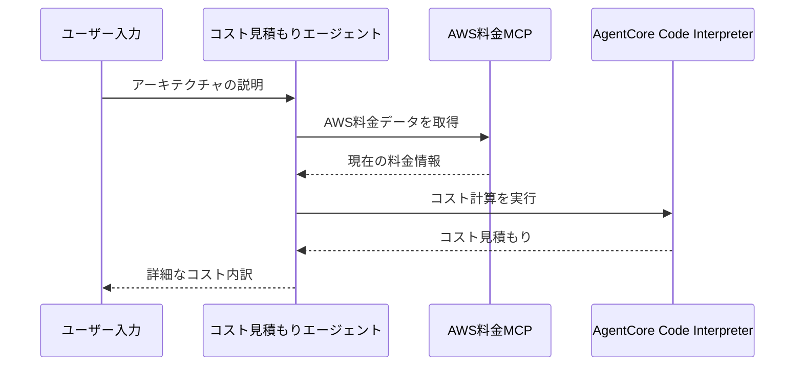

# AgentCore Code Interpreter統合

[English](README.md) / [日本語](README_ja.md)

この実装では、安全なAWSコスト見積もり計算のための **AgentCore Code Interpreter** を実演します。このエージェントは、リアルタイムのAWS料金データとサンドボックス化されたPython実行を組み合わせて、システムアーキテクチャの正確なコスト見積もりを提供します。

## プロセス概要



## 前提条件

1. **AWS認証情報** - Bedrockアクセス権限付き
2. **Python 3.12+** - async/awaitサポートに必要
3. **依存関係** - `uv`経由でインストール（pyproject.toml参照）

## 使用方法

### ファイル構成

```
01_code_interpreter/
├── README.md                           # このドキュメント
├── cost_estimator_agent/
│   ├── __init__.py                     # パッケージ初期化
│   ├── config.py                       # 設定とプロンプト
│   └── cost_estimator_agent.py         # メインエージェント実装
└── test_cost_estimator_agent.py        # テストスイート
```

### ステップ1: 基本的なコスト見積もりを実行

```bash
cd 01_code_interpreter
uv run python test_cost_estimator_agent.py
```

これにより、デフォルトのアーキテクチャでエージェントをテストし、通常のレスポンスとストリーミングレスポンスの両方を実演します。

### ステップ2: カスタムアーキテクチャでテスト

```bash
cd 01_code_interpreter
uv run python test_cost_estimator_agent.py --architecture "RDS MySQLを使用した2つのEC2 m5.largeインスタンス"
```

### ステップ3: 特定の機能をテスト

```bash
# ストリーミングレスポンスのみをテスト
cd 01_code_interpreter
uv run python test_cost_estimator_agent.py --tests streaming

# 通常のレスポンスのみをテスト
cd 01_code_interpreter
uv run python test_cost_estimator_agent.py --tests regular
```

## 主要な実装パターン

### AgentCore Code Interpreterのセットアップ

```python
from bedrock_agentcore.tools.code_interpreter_client import CodeInterpreter

def _setup_code_interpreter(self) -> None:
    """安全な計算のためのAgentCore Code Interpreterをセットアップ"""
    try:
        logger.info("AgentCore Code Interpreterをセットアップ中...")
        self.code_interpreter = CodeInterpreter(self.region)
        self.code_interpreter.start()
        logger.info("✅ AgentCore Code Interpreterセッションが正常に開始されました")
    except Exception as e:
        logger.exception(f"❌ Code Interpreterのセットアップに失敗しました: {e}")
        raise
```

### セキュアなコード実行ツール

```python
@tool
def execute_cost_calculation(self, calculation_code: str, description: str = "") -> str:
    """AgentCore Code Interpreterを使用してコスト計算を実行"""
    if not self.code_interpreter:
        return "❌ Code Interpreterが初期化されていません"
        
    try:
        # セキュアなAgentCoreサンドボックスでコードを実行
        response = self.code_interpreter.invoke("executeCode", {
            "language": "python",
            "code": calculation_code
        })
        
        # レスポンスストリームから結果を抽出
        results = []
        for event in response.get("stream", []):
            if "result" in event:
                result = event["result"]
                if "content" in result:
                    for content_item in result["content"]:
                        if content_item.get("type") == "text":
                            results.append(content_item["text"])
        
        return "\n".join(results)
    except Exception as e:
        logger.exception(f"❌ 計算に失敗しました: {e}")
```

### リソース管理パターン

```python
@contextmanager
def _estimation_agent(self) -> Generator[Agent, None, None]:
    """コスト見積もりコンポーネントのコンテキストマネージャー"""        
    try:
        # コンポーネントを順番にセットアップ
        self._setup_code_interpreter()
        aws_pricing_client = self._setup_aws_pricing_client()
        
        # execute_cost_calculationとMCP料金ツールの両方でエージェントを作成
        with aws_pricing_client:
            pricing_tools = aws_pricing_client.list_tools_sync()
            all_tools = [self.execute_cost_calculation] + pricing_tools
            agent = Agent(
                model=DEFAULT_MODEL,
                tools=all_tools,
                system_prompt=SYSTEM_PROMPT
            )
            yield agent
    finally:
        # 成功/失敗に関わらずクリーンアップを確実に実行
        self.cleanup()
```

### デルタハンドリングを使用したストリーミング

```python
async def estimate_costs_stream(self, architecture_description: str) -> AsyncGenerator[dict, None]:
    """適切なデルタハンドリングでコスト見積もりをストリーミング"""
    try:
        with self._estimation_agent() as agent:
            # 重複を防ぐための適切なデルタハンドリングを実装
            previous_output = ""
            
            async for event in agent.stream_async(prompt, callback_handler=null_callback_handler):
                if "data" in event:
                    current_chunk = str(event["data"])
                    
                    # Bedrockのベストプラクティスに従ってデルタ計算を処理
                    if current_chunk.startswith(previous_output):
                        # 新しい部分のみを抽出
                        delta_content = current_chunk[len(previous_output):]
                        if delta_content:
                            previous_output = current_chunk
                            yield {"data": delta_content}
    except Exception as e:
        yield {"error": True, "data": f"❌ ストリーミングに失敗しました: {e}"}
```

## 使用例

```python
from cost_estimator_agent import CostEstimatorAgent

agent = CostEstimatorAgent()

# 通常のレスポンス
result = await agent.estimate_costs("""
    次を含むWebアプリケーション：
    - 2x EC2 t3.mediumインスタンス
    - RDS MySQL db.t3.micro
    - Application Load Balancer
    - CloudFront付きS3バケット
""")
print(result)

# ストリーミングレスポンス
async for event in agent.estimate_costs_stream("1つのEC2 t3.microインスタンス"):
    if "data" in event:
        print(event["data"], end="", flush=True)
```

## セキュリティの利点

- **サンドボックス実行** - コードはセキュアなAgentCore環境で実行
- **ローカルコード実行なし** - すべての計算はAWSサンドボックスで実行
- **入力検証** - アーキテクチャの説明は処理前に検証
- **リソース分離** - 各計算は分離されたセッションで実行

## 参考資料

- [AgentCore Code Interpreter開発者ガイド](https://docs.aws.amazon.com/bedrock-agentcore/latest/devguide/code-interpreter.html)
- [AWS料金APIドキュメント](https://docs.aws.amazon.com/awsaccountbilling/latest/aboutv2/price-changes.html)
- [MCPプロトコル仕様](https://modelcontextprotocol.io/introduction)
- [Strands Agentsドキュメント](https://github.com/aws-samples/strands-agents)

---

**次のステップ**: この基盤を基に、追加のAWSサービスと料金シナリオを使用して、より洗練されたコスト分析エージェントを作成しましょう。