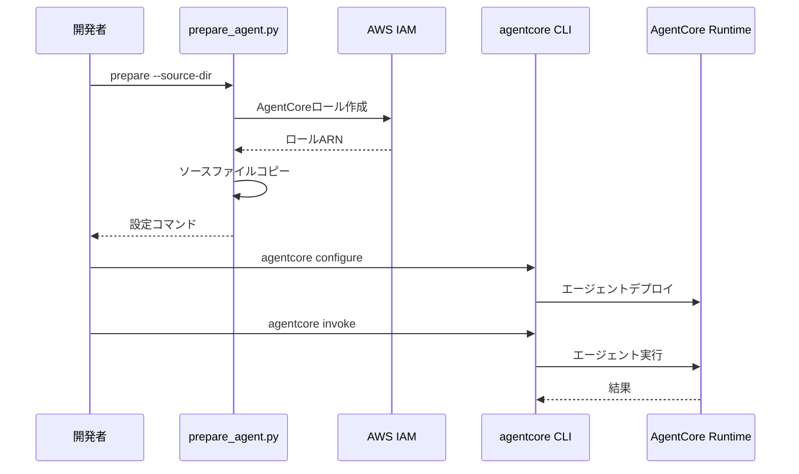

# AgentCore Runtime統合

この実装は、エージェント準備を自動化し、公式の[bedrock-agentcore-starter-toolkit](https://github.com/aws/bedrock-agentcore-starter-toolkit)とシームレスに統合する`prepare_agent.py`ツールを使用した**AgentCore Runtime**デプロイメントを実演します。

## プロセス概要



## 前提条件

1. **エージェントソースコード** - まず`01_code_interpreter`の実装を完了
2. **AWS認証情報** - ロール作成のためのIAM権限付き
3. **AgentCore CLI** - [bedrock-agentcore-starter-toolkit](https://github.com/aws/bedrock-agentcore-starter-toolkit)をインストール
4. **依存関係** - `uv`経由でインストール（pyproject.toml参照）

## 使用方法

### ファイル構造

```
02_runtime/
├── README.md                    # このドキュメント
├── prepare_agent.py             # エージェント準備ツール
└── deployment/                  # 生成されたデプロイメントディレクトリ
   ├── invoke.py                 # Runtimeエントリーポイント
   ├── requirements.txt          # 依存関係
   └── cost_estimator_agent/     # コピーされたソースファイル
```

### ステップ1: エージェントを準備

```bash
cd 02_runtime
uv run prepare_agent.py --source-dir ../01_code_interpreter/cost_estimator_agent
```

これにより、必要なすべてのAgentCore権限を持つデプロイメントディレクトリとIAMロールが作成されます。

### ステップ2: 生成されたコマンドを使用

ツールはすぐに使用できる`agentcore`コマンドを提供します：

```bash
# エージェントランタイムを設定（アカウントIDは環境に依存、prepare_agent.pyの出力を確認してください）
uv run agentcore configure --entrypoint ./deployment/invoke.py --name cost_estimator_agent --execution-role arn:aws:iam::123456789012:role/AgentCoreRole-cost_estimator_agent --requirements-file ./deployment/requirements.txt --disable-otel --region us-east-1

# エージェントを起動
uv run agentcore launch

# エージェントをテスト(レスポンスに含まれる Agent の回答はバイト配列で表示される)
uv run agentcore invoke '{"prompt": "SSH用に小規模なEC2を用意したいのですが、費用はいくらくらいでしょうか?"}'
```

## 主要な実装パターン

### エージェント準備クラス

```python
class AgentPreparer:
    """デプロイメント用のエージェント準備を処理"""
    
    def __init__(self, source_dir: str, region: str = DEFAULT_REGION):
        self.source_dir = Path(source_dir)
        self.region = region
        self.iam_client = boto3.client('iam', region_name=region)
    
    def prepare(self) -> str:
        """デプロイメントディレクトリとIAMロールを作成してエージェントをデプロイメント用に準備"""
        # デプロイメントディレクトリを作成
        deployment_dir = self.create_source_directory()
        
        # IAMロールを作成
        role_info = self.create_agentcore_role()

        # agentcore configureコマンドを構築
        command = f"agentcore configure --entrypoint {deployment_dir}/invoke.py " \
                    f"--name {self.agent_name} " \
                    f"--execution-role {role_info['role_arn']} " \
                    f"--requirements-file {deployment_dir}/requirements.txt " \
                    f"--region {self.region}"

        return command
```

### AgentCore権限を持つIAMロール作成

```python
def create_agentcore_role(self) -> dict:
    """AgentCore権限を持つIAMロールを作成"""
    role_name = f"AgentCoreRole-{self.agent_name}"
    
    # bedrock-agentcoreサービス用の信頼ポリシー
    trust_policy = {
        "Version": "2012-10-17",
        "Statement": [
            {
                "Effect": "Allow",
                "Principal": {
                    "Service": "bedrock-agentcore.amazonaws.com"
                },
                "Action": "sts:AssumeRole",
                "Condition": {
                    "StringEquals": {
                        "aws:SourceAccount": account_id
                    },
                    "ArnLike": {
                        "aws:SourceArn": f"arn:aws:bedrock-agentcore:{self.region}:{account_id}:*"
                    }
                }
            }
        ]
    }
    
    # 包括的なAgentCore権限を持つ実行ポリシー
    execution_policy = {
        "Version": "2012-10-17",
        "Statement": [
            {
                "Sid": "BedrockPermissions",
                "Effect": "Allow",
                "Action": [
                    "bedrock:InvokeModel",
                    "bedrock:InvokeModelWithResponseStream"
                ],
                "Resource": "*"
            },
            {
                "Effect": "Allow",
                "Action": [
                    "bedrock-agentcore:CreateCodeInterpreter",
                    "bedrock-agentcore:StartCodeInterpreterSession",
                    "bedrock-agentcore:InvokeCodeInterpreter",
                    "bedrock-agentcore:StopCodeInterpreterSession",
                    "bedrock-agentcore:DeleteCodeInterpreter"
                ],
                "Resource": "arn:aws:bedrock-agentcore:*:*:*"
            }
        ]
    }
```

### Runtimeエントリーポイントパターン

```python
# deployment/invoke.py
from bedrock_agentcore.runtime import BedrockAgentCoreApp

app = BedrockAgentCoreApp()

@app.entrypoint
def invoke(payload):
    user_input = payload.get("prompt")
    agent = AWSCostEstimatorAgent()
    return agent.estimate_costs(user_input)

if __name__ == "__main__":
    app.run()
```

## 使用例

```python
# デプロイメント用にエージェントを準備
preparer = AgentPreparer("../01_code_interpreter/cost_estimator_agent")
configure_command = preparer.prepare()

# 生成されたコマンドを使用してデプロイ
# agentcore configure --entrypoint ./deployment/invoke.py ...
# agentcore launch
# agentcore invoke '{"prompt": "Cost for t3.micro EC2?"}'
```

## 統合の利点

- **自動セットアップ** - デプロイメントディレクトリとIAMロール作成を処理
- **権限コンプライアンス** - 公式のAgentCoreランタイム権限に従う
- **CLI統合** - agentcoreツールキットとのシームレスなワークフロー
- **エラーハンドリング** - 包括的なログとエラー管理

## 参考資料

- [AgentCore Runtime Developer Guide](https://docs.aws.amazon.com/bedrock-agentcore/latest/devguide/runtime.html)
- [Runtime Permissions Documentation](https://docs.aws.amazon.com/bedrock-agentcore/latest/devguide/runtime-permissions.html)
- [Bedrock AgentCore Starter Toolkit](https://github.com/aws/bedrock-agentcore-starter-toolkit)
- [AgentCore CLI Documentation](https://github.com/aws/bedrock-agentcore-starter-toolkit)

---

**次のステップ**: 生成された`agentcore`コマンドを使用して準備されたエージェントをデプロイし、安全な操作のために[03_identity](../03_identity/README.md)でアイデンティティ認証を統合してください。
