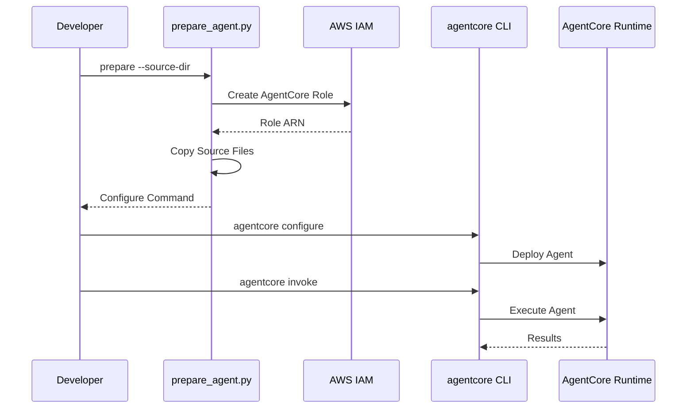

# AgentCore Runtime Integration

[English](README.md) / [日本語](README_ja.md)

This implementation demonstrates **AgentCore Runtime** deployment using the `prepare_agent.py` tool that automates agent preparation and seamlessly integrates with the official [bedrock-agentcore-starter-toolkit](https://github.com/aws/bedrock-agentcore-starter-toolkit).

## Process Overview



## Prerequisites

1. **Agent source code** - Complete `01_code_interpreter` implementation first
2. **AWS credentials** - With IAM permissions for role creation
3. **AgentCore CLI** - Install [bedrock-agentcore-starter-toolkit](https://github.com/aws/bedrock-agentcore-starter-toolkit)
4. **Dependencies** - Installed via `uv` (see pyproject.toml)

## How to use

### File Structure

```
02_runtime/
├── README.md                    # This documentation
├── prepare_agent.py             # Agent preparation tool
└── deployment/                  # Generated deployment directory
   ├── invoke.py                 # Runtime entrypoint
   ├── requirements.txt          # Dependencies
   └── cost_estimator_agent/     # Copied source files
```

### Step 1: Prepare Your Agent

```bash
cd 02_runtime
uv run prepare_agent.py --source-dir ../01_code_interpreter/cost_estimator_agent
```

This will create deployment directory and IAM role with all necessary AgentCore permissions.

### Step 2: Use Generated Commands

The tool provides ready-to-use `agentcore` commands:

```bash
# Configure the agent runtime (account id depends on your environment, please confirm outputs of prepare_agent.py)
uv run agentcore configure --entrypoint ./deployment/invoke.py --name cost_estimator_agent --execution-role arn:aws:iam::123456789012:role/AgentCoreRole-cost_estimator_agent --requirements-file ./deployment/requirements.txt --disable-otel --region us-east-1

# Launch the agent
uv run agentcore launch

# Test your agent
uv run agentcore invoke '{"prompt": "I would like to prepare small EC2 for ssh. How much does it cost?"}'
```

## Key Implementation Pattern

### Agent Preparation Class

```python
class AgentPreparer:
    """Handles preparation of agent for deployment"""
    
    def __init__(self, source_dir: str, region: str = DEFAULT_REGION):
        self.source_dir = Path(source_dir)
        self.region = region
        self.iam_client = boto3.client('iam', region_name=region)
    
    def prepare(self) -> str:
        """Prepare agent for deployment by creating deployment directory and IAM role"""
        # Create deployment directory
        deployment_dir = self.create_source_directory()
        
        # Create IAM role
        role_info = self.create_agentcore_role()

        # Build agentcore configure command
        command = f"agentcore configure --entrypoint {deployment_dir}/invoke.py " \
                    f"--name {self.agent_name} " \
                    f"--execution-role {role_info['role_arn']} " \
                    f"--requirements-file {deployment_dir}/requirements.txt " \
                    f"--region {self.region}"

        return command
```

### IAM Role Creation with AgentCore Permissions

```python
def create_agentcore_role(self) -> dict:
    """Create IAM role with AgentCore permissions"""
    role_name = f"AgentCoreRole-{self.agent_name}"
    
    # Trust policy for bedrock-agentcore service
    trust_policy = {
        "Version": "2012-10-17",
        "Statement": [
            {
                "Effect": "Allow",
                "Principal": {
                    "Service": "bedrock-agentcore.amazonaws.com"
                },
                "Action": "sts:AssumeRole",
                "Condition": {
                    "StringEquals": {
                        "aws:SourceAccount": account_id
                    },
                    "ArnLike": {
                        "aws:SourceArn": f"arn:aws:bedrock-agentcore:{self.region}:{account_id}:*"
                    }
                }
            }
        ]
    }
    
    # Execution policy with comprehensive AgentCore permissions
    execution_policy = {
        "Version": "2012-10-17",
        "Statement": [
            {
                "Sid": "BedrockPermissions",
                "Effect": "Allow",
                "Action": [
                    "bedrock:InvokeModel",
                    "bedrock:InvokeModelWithResponseStream"
                ],
                "Resource": "*"
            },
            {
                "Effect": "Allow",
                "Action": [
                    "bedrock-agentcore:CreateCodeInterpreter",
                    "bedrock-agentcore:StartCodeInterpreterSession",
                    "bedrock-agentcore:InvokeCodeInterpreter",
                    "bedrock-agentcore:StopCodeInterpreterSession",
                    "bedrock-agentcore:DeleteCodeInterpreter"
                ],
                "Resource": "arn:aws:bedrock-agentcore:*:*:*"
            }
        ]
    }
```

### Runtime Entrypoint Pattern

```python
# deployment/invoke.py
from bedrock_agentcore.runtime import BedrockAgentCoreApp

app = BedrockAgentCoreApp()

@app.entrypoint
def invoke(payload):
    user_input = payload.get("prompt")
    agent = AWSCostEstimatorAgent()
    return agent.estimate_costs(user_input)

if __name__ == "__main__":
    app.run()
```

## Usage Example

```python
# Prepare agent for deployment
preparer = AgentPreparer("../01_code_interpreter/cost_estimator_agent")
configure_command = preparer.prepare()

# Use generated command to deploy
# agentcore configure --entrypoint ./deployment/invoke.py ...
# agentcore launch
# agentcore invoke '{"prompt": "Cost for t3.micro EC2?"}'
```

## Integration Benefits

- **Automated setup** - Handles deployment directory and IAM role creation
- **Permission compliance** - Follows official AgentCore runtime permissions
- **CLI integration** - Seamless workflow with agentcore toolkit
- **Error handling** - Comprehensive logging and error management

## References

- [AgentCore Runtime Developer Guide](https://docs.aws.amazon.com/bedrock-agentcore/latest/devguide/runtime.html)
- [Runtime Permissions Documentation](https://docs.aws.amazon.com/bedrock-agentcore/latest/devguide/runtime-permissions.html)
- [Bedrock AgentCore Starter Toolkit](https://github.com/aws/bedrock-agentcore-starter-toolkit)
- [AgentCore CLI Documentation](https://github.com/aws/bedrock-agentcore-starter-toolkit)

---

**Next Steps**: Deploy your prepared agent using the generated `agentcore` commands and integrate identity authentication with [03_identity](../03_identity/README.md) for secure operations.
