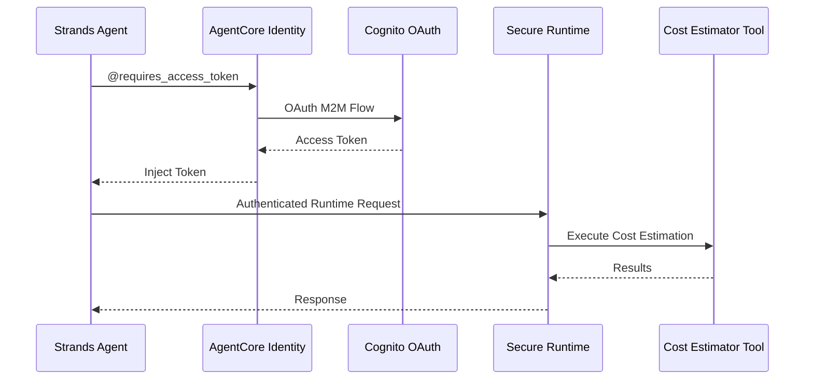

# AgentCore Identity Integration

[English](README.md) / [日本語](README_ja.md)

This implementation demonstrates **AgentCore Identity** with OAuth 2.0 authentication for secure Runtime invocation. The `@requires_access_token` decorator provides transparent token management for authenticated agent operations.

## Process Overview



## Prerequisites

1. **Runtime deployed** - Complete `02_runtime` setup first
2. **AWS credentials** - With `bedrock-agentcore-control` permissions
3. **Dependencies** - Installed via `uv` (see pyproject.toml)

## How to use

### File Structure

```
03_identity/
├── README.md                      # This documentation
├── setup_inbound_authorizer.py    # OAuth2 provider and secure runtime setup
└── test_identity_agent.py         # Test agent with identity authentication
```

### Step 1: Create OAuth2 Credential Provider and Secure Runtime

```bash
cd 03_identity
uv run python setup_inbound_authorizer.py
```

This script will:
- Create a Cognito OAuth authorizer with M2M client credentials
- Set up an AgentCore Identity OAuth2 credential provider
- Deploy a secure runtime with JWT authorization
- Generate configuration in `inbound_authorizer.json`

### Step 2: Test Identity-Protected Agent

```bash
cd 03_identity
uv run python test_identity_agent.py
```

This will test the complete authentication flow including token acquisition and secure runtime invocation.

## Key Implementation Pattern

### Using @requires_access_token with Strands Tools

```python
from strands import tool
from bedrock_agentcore.identity.auth import requires_access_token

@tool(name="cost_estimator_tool", description="Estimate cost of AWS from architecture description")
@requires_access_token(
    provider_name=OAUTH_PROVIDER,
    scopes=[OAUTH_SCOPE],
    auth_flow="M2M",
    force_authentication=False
)
async def cost_estimator_tool(architecture_description, access_token: str) -> str:
    """Access token is automatically injected by the decorator"""
    headers = {
        "Authorization": f"Bearer {access_token}",
        "Content-Type": "application/json"
    }
    
    response = requests.post(RUNTIME_URL, headers=headers, data=json.dumps({
        "prompt": architecture_description
    }))
    
    return response.text
```

### Agent Integration Pattern

```python
from strands import Agent

agent = Agent(
    system_prompt="You are a professional solution architect...",
    tools=[cost_estimator_tool]
)

# The agent automatically handles token acquisition and injection
await agent.invoke_async("Architecture description here...")
```

## Usage Example

```python
import asyncio
from strands import Agent
from test_identity_agent import cost_estimator_tool

agent = Agent(
    system_prompt=(
        "Your are a professional solution architect. "
        "You will receive architecture descriptions or requirements from customers. "
        "Please provide estimate by using 'cost_estimator_tool'"
    ),
    tools=[cost_estimator_tool]
)

# Test with architecture description
architecture = """
A simple web application with:
- Application Load Balancer
- 2x EC2 t3.medium instances  
- RDS MySQL database in us-east-1
"""

result = await agent.invoke_async(architecture)
print(result)
```

## Security Benefits

- **Zero token exposure** - Tokens never appear in logs/code
- **Automatic lifecycle management** - AgentCore handles expiration
- **Runtime-level security** - JWT authorization at the runtime level
- **M2M authentication** - Suitable for automated systems

## References

- [AgentCore Identity Developer Guide](https://docs.aws.amazon.com/bedrock-agentcore/latest/devguide/identity.html)
- [OAuth 2.0 Client Credentials Flow](https://tools.ietf.org/html/rfc6749#section-4.4)
- [Cognito OAuth Integration](https://docs.aws.amazon.com/cognito/latest/developerguide/cognito-user-pools-app-integration.html)
- [Strands Agents Documentation](https://github.com/aws-samples/strands-agents)

---

**Next Steps**: Integrate identity-protected agents into your applications using the patterns demonstrated here, or continue with [04_gateway](../04_gateway/README.md) to expose agents through MCP-compatible APIs.
