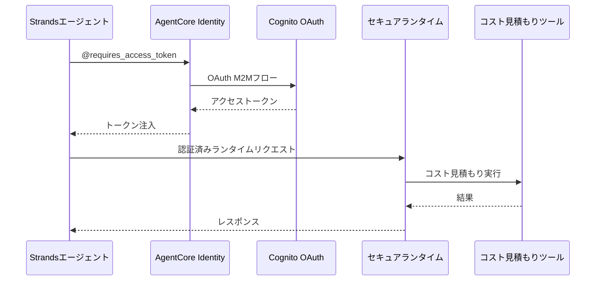

# AgentCore Identity統合

この実装は、安全なRuntime呼び出しのためのOAuth 2.0認証を伴う**AgentCore Identity**を実演します。`@requires_access_token`デコレーターは、認証されたエージェント操作のための透明なトークン管理を提供します。

## プロセス概要



## 前提条件

1. **Runtimeデプロイ済み** - まず`02_runtime`のセットアップを完了
2. **AWS認証情報** - `bedrock-agentcore-control`権限付き
3. **依存関係** - `uv`経由でインストール（pyproject.toml参照）

## 使用方法

### ファイル構造

```
03_identity/
├── README.md                      # このドキュメント
├── setup_inbound_authorizer.py    # OAuth2プロバイダーと安全なランタイムセットアップ
└── test_identity_agent.py         # アイデンティティ認証付きエージェントテスト
```

### ステップ1: OAuth2認証情報プロバイダーと安全なランタイムを作成

```bash
cd 03_identity
uv run python setup_inbound_authorizer.py
```

このスクリプトは以下を実行します：
- M2Mクライアント認証情報でCognito OAuthオーソライザーを作成
- AgentCore Identity OAuth2認証情報プロバイダーをセットアップ
- JWT認証付きの安全なランタイムをデプロイ
- `inbound_authorizer.json`に設定を生成

### ステップ2: アイデンティティ保護されたエージェントをテスト

```bash
cd 03_identity
uv run python test_identity_agent.py
```

これは、トークン取得と安全なランタイム呼び出しを含む完全な認証フローをテストします。

## 主要な実装パターン

### Strandsツールでの@requires_access_tokenの使用

```python
from strands import tool
from bedrock_agentcore.identity.auth import requires_access_token

@tool(name="cost_estimator_tool", description="アーキテクチャの説明からAWSのコストを見積もる")
@requires_access_token(
    provider_name=OAUTH_PROVIDER,
    scopes=[OAUTH_SCOPE],
    auth_flow="M2M",
    force_authentication=False
)
async def cost_estimator_tool(architecture_description, access_token: str) -> str:
    """アクセストークンはデコレーターによって自動的に注入されます"""
    headers = {
        "Authorization": f"Bearer {access_token}",
        "Content-Type": "application/json"
    }
    
    response = requests.post(RUNTIME_URL, headers=headers, data=json.dumps({
        "prompt": architecture_description
    }))
    
    return response.text
```

### エージェント統合パターン

```python
from strands import Agent

agent = Agent(
    system_prompt="あなたはプロのソリューション アーキテクトです...",
    tools=[cost_estimator_tool]
)

# エージェントはトークン取得と注入を自動的に処理します
await agent.invoke_async("アーキテクチャの説明はここにあります...")
```

## 使用例

```python
import asyncio
from strands import Agent
from test_identity_agent import cost_estimator_tool

agent = Agent(
    system_prompt=(
        "あなたはプロのソリューション アーキテクトです。"
        "顧客からアーキテクチャの説明や要件を受け取ります。"
        "「cost_estimator_tool」を使用して見積もりを提供してください"
    ),
    tools=[cost_estimator_tool]
)

# アーキテクチャ説明でテスト
architecture = """
以下のコンポーネントを備えたシンプルなウェブアプリケーション
- アプリケーションロードバランサー
- EC2 t3.medium インスタンス 2 台
- us-east-1 の RDS MySQL データベース
"""

result = await agent.invoke_async(architecture)
print(result)
```

## セキュリティ上の利点

- **トークンの非公開** - トークンはログ/コードに表示されません
- **自動ライフサイクル管理** - AgentCoreが有効期限を処理
- **ランタイムレベルセキュリティ** - ランタイムレベルでのJWT認証
- **M2M認証** - 自動化システムに適合

## 参考資料

- [AgentCore Identity Developer Guide](https://docs.aws.amazon.com/bedrock-agentcore/latest/devguide/identity.html)
- [OAuth 2.0 Client Credentials Flow](https://tools.ietf.org/html/rfc6749#section-4.4)
- [Cognito OAuth Integration](https://docs.aws.amazon.com/cognito/latest/developerguide/cognito-user-pools-app-integration.html)
- [Strands Agents Documentation](https://github.com/aws-samples/strands-agents)

---

**次のステップ**: ここで実演されたパターンを使用してアイデンティティ保護されたエージェントをアプリケーションに統合するか、[04_gateway](../04_gateway/README.md)に進んでMCP互換APIを通じてエージェントを公開してください。
