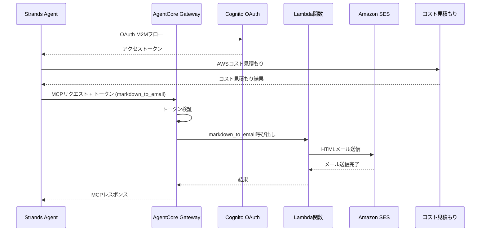

# AgentCore Outbound Gateway 統合

この実装では、`markdown_to_email` ツールを提供するLambda統合を持つ **AgentCore Outbound Gateway** を、`01_code_interpreter` のコスト見積もり機能とGatewayのメール機能の両方を使用するStrands Agentと組み合わせてデモンストレーションします。

## プロセス概要



## 前提条件

1. **Identityセットアップ** - OAuth認証のためにまず `03_identity` のセットアップを完了してください
2. **AWS SAM CLI** - Lambdaデプロイ用
3. **Amazon SES** - 検証済みの送信者メールアドレス
4. **AWS認証情報** - Gateway、Lambda、SESの権限付き
5. **依存関係** - `uv` 経由でインストール (pyproject.tomlを参照)

## 使用方法

### ファイル構成

```
04_gateway/
├── README.md                      # このドキュメント
├── src/app.py                     # Lambda関数の実装
├── template.yaml                  # Lambda用SAMテンプレート
├── deploy.sh                      # Lambdaデプロイスクリプト
├── setup_outbound_gateway.py      # Cognitoを使ったGatewayセットアップ
├── test_gateway.py                # Strands AgentでのGatewayテスト
└── outbound_gateway.json          # 生成された設定ファイル
```

### ステップ 1: Lambda関数のデプロイ

```bash
cd 04_gateway
./deploy.sh your-verified-email@example.com
```

SESメール機能を持つLambda関数をSAMでデプロイし、設定を `outbound_gateway.json` に保存します。
Amazon SES用にメールアドレスを検証してください。

### ステップ 2: Outbound Gatewayの作成

```bash
cd 04_gateway
uv run setup_outbound_gateway.py
```

`03_identity` かOAuth認証とLambdaターゲット統合を持つGatewayを作成します。

### ステップ 3: Gateway統合のテスト

```bash
cd 04_gateway
# アーキテクチャ説明とメールアドレスでテスト
uv run test_gateway.py --architecture "ALBと2つのEC2インスタンスを使用したWebアプリ" --address recipient@example.com
```

## 主要な実装パターン

### Markdown-to-Emailツールを持つLambda関数

Lambda関数は、markdownコンテンツをHTMLに変換し、Amazon SES経由で送信する `markdown_to_email` ツールを提供します：

```python
def lambda_handler(event, context):
    """Gatewayからのmarkdown_to_emailツール呼び出しを処理"""
    try:
        # Gatewayコンテキストからツール名を抽出
        tool_name = context.client_context.custom.get('bedrockAgentCoreToolName', '')
        
        # Gatewayプレフィックスを除去 (形式: targetName___toolName)
        if "___" in tool_name:
            tool_name = tool_name.split("___")[-1]
        
        # markdown_to_emailツールであることを確認
        if tool_name != 'markdown_to_email':
            return {'statusCode': 400, 'body': f"Unknown tool: {tool_name}"}
        
        # イベントからパラメータを抽出
        markdown_text = event.get('markdown_text', '')
        email_address = event.get('email_address', '')
        subject = event.get('subject', 'AWS Cost Estimation Report')
        
        # markdownをHTMLに変換してメール送信
        result = send_markdown_email(markdown_text, email_address, subject)
        
        return {'statusCode': 200, 'body': result}
        
    except Exception as e:
        logger.exception(f"Error processing request: {e}")
        return {'statusCode': 500, 'body': f"Error: {str(e)}"}
```

### Cognito OAuthを使ったGateway作成

```python
def setup_gateway(provider_name: str = PROVIDER_NAME, force: bool = False) -> dict:
    """Cognito OAuth認証でGatewayをセットアップ"""
    
    # 03_identityからidentity設定を読み込み
    with open(IDENTITY_FILE) as f:
        identity_config = json.load(f)

    gateway_name = "AWSCostEstimatorGateway"
    authorizer_config = {
        "customJWTAuthorizer": {
            "discoveryUrl": identity_config["cognito"]["discovery_url"],
            "allowedClients": [identity_config["cognito"]["client_id"]]
        }
    }
    
    # MCP Gatewayを作成
    gateway = gateway_client.create_mcp_gateway(
        name=gateway_name,
        role_arn=None,
        authorizer_config=authorizer_config,
        enable_semantic_search=False
    )
    
    # markdown_to_emailツールスキーマでLambdaターゲットを追加
    tool_schema = [{
        "name": "markdown_to_email",
        "description": "Convert Markdown content to email format",
        "inputSchema": {
            "type": "object",
            "properties": {
                "markdown_text": {
                    "type": "string",
                    "description": "Markdown content to convert to email format"
                },
                "email_address": {
                    "type": "string",
                    "description": "Recipient email address"
                },
                "subject": {
                    "type": "string",
                    "description": "Title of email"
                }
            },
            "required": ["markdown_text", "email_address"]
        }
    }]
    
    create_request = {
        "gatewayIdentifier": gateway_id,
        "name": target_name,
        "targetConfiguration": {
            "mcp": {
                "lambda": {
                    "lambdaArn": config["lambda_arn"],
                    "toolSchema": {"inlinePayload": tool_schema}
                }
            }
        },
        "credentialProviderConfigurations": [{"credentialProviderType": "GATEWAY_IAM_ROLE"}]
    }
```

### MCP Clientを使ったStrands Agent統合

```python
def estimate_and_send(architecture_description, address):
    """MCPクライアントでStrands Agentを使ってGatewayをテスト"""
    
    # OAuthアクセストークンを取得
    access_token = asyncio.run(get_access_token())
    
    # 認証付きMCPクライアントを作成
    def create_transport():
        return streamablehttp_client(
            GATEWAY_URL,
            headers={"Authorization": f"Bearer {access_token}"}
        )

    mcp_client = MCPClient(create_transport)
    
    # ローカルコスト見積もりツールとGatewayツールを結合
    tools = [cost_estimator_tool]  # ローカルツール
    
    with mcp_client:
        # Gatewayからツールを取得 (markdown_to_email)
        more_tools = True
        pagination_token = None
        while more_tools:
            tmp_tools = mcp_client.list_tools_sync(pagination_token=pagination_token)
            tools.extend(tmp_tools)
            if tmp_tools.pagination_token is None:
                more_tools = False
            else:
                pagination_token = tmp_tools.pagination_token

        # ローカルとGatewayの両方のツールでエージェントを作成
        agent = Agent(
            system_prompt=(
                "あなたはプロのソリューションアーキテクトです。AWSプラットフォームのコストを概算してください。"
                "1. 顧客の要件を `architecture_description` に 10 ～ 50 語で要約してください。"
                "2. `architecture_description` を 'cost_estimator_tool' に渡します。"
                "3. 見積書を `markdown_to_email` で送信します。"
            ),
            tools=tools
        )
        
        # エージェントは両方のツールを自動的に使用
        prompt = f"requirements: {architecture_description}, address: {address}"
        result = agent(prompt)
        return result
```

## 使用例

```bash
# SES送信者メールでLambda関数をデプロイ
./deploy.sh your-verified-email@example.com

# Cognito認証でGatewayを作成
uv run setup_outbound_gateway.py

# Strands Agentでテスト - コスト見積もりとメール送信結果
uv run test_gateway.py --architecture "ALBと2つのEC2インスタンスを使用したWebアプリ" --address recipient@example.com
```

## 統合のメリット

- **サーバーレスアーキテクチャ** - Lambdaは需要に応じて自動スケール
- **OAuthセキュリティ** - Cognitoがエンタープライズグレードの認証を提供
- **MCP互換性** - ツール統合の標準プロトコル
- **メール配信** - SES経由でのmarkdown-to-HTMLメール変換の自動化
- **マルチツールオーケストレーション** - ローカルコスト見積もりとリモートメール機能を結合

## 参考資料

- [AgentCore Gateway開発者ガイド](https://docs.aws.amazon.com/bedrock-agentcore/latest/devguide/gateway.html)
- [AWS SAMドキュメント](https://docs.aws.amazon.com/serverless-application-model/)
- [Cognito OAuth統合](https://docs.aws.amazon.com/cognito/latest/developerguide/cognito-user-pools-app-integration.html)
- [MCPプロトコル仕様cation](https://modelcontextprotocol.io/introduction)

---

**次のステップ**: ゲートウェイをアプリケーション内の MCP サーバーとして使用するか、AgentCore Identity と統合してセキュリティを強化します。
