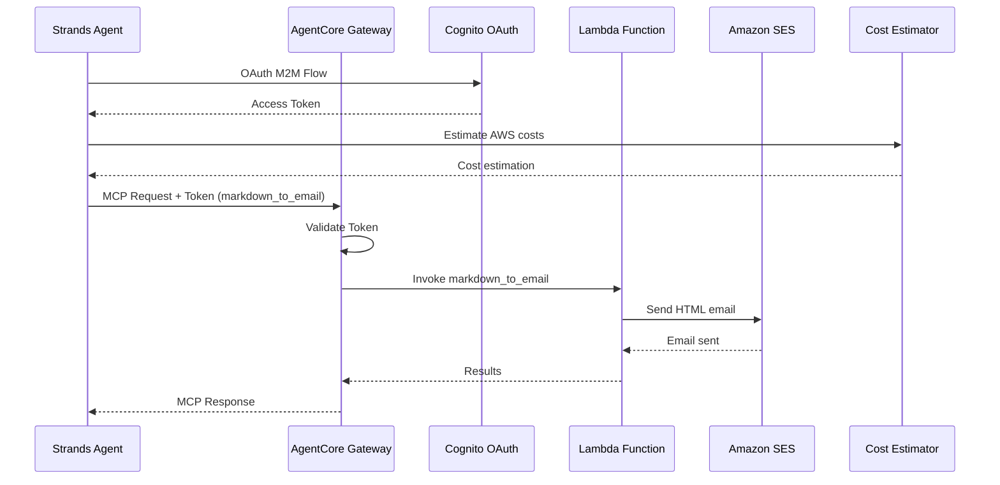

# AgentCore Outbound Gateway Integration

[English](README.md) / [日本語](README_ja.md)

This implementation demonstrates **AgentCore Outbound Gateway** with Lambda integration that provides a `markdown_to_email` tool, combined with a Strands Agent that uses both the cost estimator from `01_code_interpreter` and the Gateway's email functionality.

## Process Overview



## Prerequisites

1. **Identity setup** - Complete `03_identity` setup first for OAuth authentication
2. **AWS SAM CLI** - For Lambda deployment
3. **Amazon SES** - Verified sender email address
4. **AWS credentials** - With Gateway, Lambda, and SES permissions
5. **Dependencies** - Installed via `uv` (see pyproject.toml)

## How to use

### File Structure

```
04_gateway/
├── README.md                      # This documentation
├── src/app.py                     # Lambda function implementation
├── template.yaml                  # SAM template for Lambda
├── deploy.sh                      # Lambda deployment script
├── setup_outbound_gateway.py      # Gateway setup with Cognito
├── test_gateway.py                # Gateway testing with Strands Agent
└── outbound_gateway.json          # Generated configuration
```

### Step 1: Deploy Lambda Function

```bash
cd 04_gateway
./deploy.sh your-verified-email@example.com
```

This deploys the Lambda function using SAM with SES email functionality and saves configuration to `outbound_gateway.json`.
Please verify your email address for Amazon SES.

### Step 2: Create Outbound Gateway

```bash
cd 04_gateway
uv run setup_outbound_gateway.py
```

This creates the Gateway with OAuth authentication from `03_identity` and Lambda target integration.

### Step 3: Test Gateway Integration

```bash
cd 04_gateway
# Test with architecture description and email address
uv run test_gateway.py --architecture "A web app with ALB and 2 EC2 instances" --address recipient@example.com
```

## Key Implementation Pattern

### Lambda Function with Markdown-to-Email Tool

The Lambda function provides a `markdown_to_email` tool that converts markdown content to HTML and sends it via Amazon SES:

```python
def lambda_handler(event, context):
    """Handle markdown_to_email tool invocation from Gateway"""
    try:
        # Extract tool name from Gateway context
        tool_name = context.client_context.custom.get('bedrockAgentCoreToolName', '')
        
        # Remove Gateway prefix (format: targetName___toolName)
        if "___" in tool_name:
            tool_name = tool_name.split("___")[-1]
        
        # Verify this is the markdown_to_email tool
        if tool_name != 'markdown_to_email':
            return {'statusCode': 400, 'body': f"Unknown tool: {tool_name}"}
        
        # Extract parameters from event
        markdown_text = event.get('markdown_text', '')
        email_address = event.get('email_address', '')
        subject = event.get('subject', 'AWS Cost Estimation Report')
        
        # Convert markdown to HTML and send email
        result = send_markdown_email(markdown_text, email_address, subject)
        
        return {'statusCode': 200, 'body': result}
        
    except Exception as e:
        logger.exception(f"Error processing request: {e}")
        return {'statusCode': 500, 'body': f"Error: {str(e)}"}
```

### Gateway Creation with Cognito OAuth

```python
def setup_gateway(provider_name: str = PROVIDER_NAME, force: bool = False) -> dict:
    """Setup Gateway with Cognito OAuth authentication"""
    
    # Load identity configuration from 03_identity
    with open(IDENTITY_FILE) as f:
        identity_config = json.load(f)

    gateway_name = "AWSCostEstimatorGateway"
    authorizer_config = {
        "customJWTAuthorizer": {
            "discoveryUrl": identity_config["cognito"]["discovery_url"],
            "allowedClients": [identity_config["cognito"]["client_id"]]
        }
    }
    
    # Create MCP Gateway
    gateway = gateway_client.create_mcp_gateway(
        name=gateway_name,
        role_arn=None,
        authorizer_config=authorizer_config,
        enable_semantic_search=False
    )
    
    # Add Lambda target with markdown_to_email tool schema
    tool_schema = [{
        "name": "markdown_to_email",
        "description": "Convert Markdown content to email format",
        "inputSchema": {
            "type": "object",
            "properties": {
                "markdown_text": {
                    "type": "string",
                    "description": "Markdown content to convert to email format"
                },
                "email_address": {
                    "type": "string",
                    "description": "Recipient email address"
                },
                "subject": {
                    "type": "string",
                    "description": "Title of email"
                }
            },
            "required": ["markdown_text", "email_address"]
        }
    }]
    
    create_request = {
        "gatewayIdentifier": gateway_id,
        "name": target_name,
        "targetConfiguration": {
            "mcp": {
                "lambda": {
                    "lambdaArn": config["lambda_arn"],
                    "toolSchema": {"inlinePayload": tool_schema}
                }
            }
        },
        "credentialProviderConfigurations": [{"credentialProviderType": "GATEWAY_IAM_ROLE"}]
    }
```

### Strands Agent Integration with MCP Client

```python
def estimate_and_send(architecture_description, address):
    """Test Gateway using Strands Agent with MCP client"""
    
    # Get OAuth access token
    access_token = asyncio.run(get_access_token())
    
    # Create MCP client with authentication
    def create_transport():
        return streamablehttp_client(
            GATEWAY_URL,
            headers={"Authorization": f"Bearer {access_token}"}
        )

    mcp_client = MCPClient(create_transport)
    
    # Combine local cost estimator tool with Gateway tools
    tools = [cost_estimator_tool]  # Local tool
    
    with mcp_client:
        # Get tools from Gateway (markdown_to_email)
        more_tools = True
        pagination_token = None
        while more_tools:
            tmp_tools = mcp_client.list_tools_sync(pagination_token=pagination_token)
            tools.extend(tmp_tools)
            if tmp_tools.pagination_token is None:
                more_tools = False
            else:
                pagination_token = tmp_tools.pagination_token

        # Create agent with both local and Gateway tools
        agent = Agent(
            system_prompt=(
                "Your are a professional solution architect. Please estimate cost of AWS platform."
                "1. Please summarize customer's requirement to `architecture_description` in 10~50 words."
                "2. Pass `architecture_description` to 'cost_estimator_tool'."
                "3. Send estimation by `markdown_to_email`."
            ),
            tools=tools
        )
        
        # Agent will use both tools automatically
        prompt = f"requirements: {architecture_description}, address: {address}"
        result = agent(prompt)
        return result
```

## Usage Example

```bash
# Deploy Lambda function with SES sender email
./deploy.sh your-verified-email@example.com

# Create Gateway with Cognito authentication
uv run setup_outbound_gateway.py

# Test with Strands Agent - estimates costs and emails results
uv run test_gateway.py --architecture "A web app with ALB and 2 EC2 instances" --address recipient@example.com
```

## Integration Benefits

- **Serverless architecture** - Lambda scales automatically with demand
- **OAuth security** - Cognito provides enterprise-grade authentication
- **MCP compatibility** - Standard protocol for tool integration
- **Email delivery** - Automated markdown-to-HTML email conversion via SES
- **Multi-tool orchestration** - Combines local cost estimation with remote email functionality

## References

- [AgentCore Gateway Developer Guide](https://docs.aws.amazon.com/bedrock-agentcore/latest/devguide/gateway.html)
- [AWS SAM Documentation](https://docs.aws.amazon.com/serverless-application-model/)
- [Cognito OAuth Integration](https://docs.aws.amazon.com/cognito/latest/developerguide/cognito-user-pools-app-integration.html)
- [MCP Protocol Specification](https://modelcontextprotocol.io/introduction)

---

**Next Steps**: Use the Gateway as an MCP server in your applications or integrate with AgentCore Identity for enhanced security.
