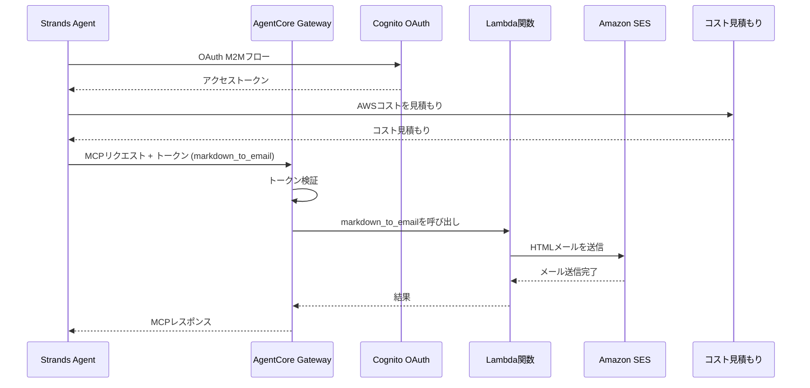

# AgentCore Outbound Gateway統合

[English](README.md) / [日本語](README_ja.md)

この実装では、**AgentCore Outbound Gateway** とLambda統合を実演し、`markdown_to_email`ツールを提供します。これは`01_code_interpreter`のコスト見積もりとGatewayのメール機能の両方を使用するStrands Agentと組み合わせています。

## プロセス概要



## 前提条件

1. **Identity設定** - OAuth認証のため、まず`03_identity`設定を完了
2. **AWS SAM CLI** - Lambdaデプロイメント用
3. **Amazon SES** - 検証済み送信者メールアドレス
4. **AWS認証情報** - Gateway、Lambda、SES権限付き
5. **依存関係** - `uv`経由でインストール（pyproject.toml参照）

## 使用方法

### ファイル構成

```
04_gateway/
├── README.md                      # このドキュメント
├── src/app.py                     # Lambda関数実装
├── template.yaml                  # Lambda用SAMテンプレート
├── deploy.sh                      # Lambdaデプロイスクリプト
├── setup_outbound_gateway.py      # Cognito付きGatewayセットアップ
├── test_gateway.py                # Strands AgentでのGatewayテスト
└── outbound_gateway.json          # 生成された設定
```

### ステップ1: Lambda関数をデプロイ

```bash
cd 04_gateway
./deploy.sh your-verified-email@example.com
```

これにより、SESメール機能付きのLambda関数がSAMを使用してデプロイされ、設定が`outbound_gateway.json`に保存されます。
Amazon SESでメールアドレスを検証してください。

### ステップ2: Outbound Gatewayを作成

```bash
cd 04_gateway
uv run setup_outbound_gateway.py
```

これにより、`03_identity`からのOAuth認証とLambdaターゲット統合を備えたGatewayが作成されます。

### ステップ3: Gateway統合をテスト

```bash
cd 04_gateway
# アーキテクチャの説明とメールアドレスでテスト
uv run test_gateway.py --architecture "ALBと2つのEC2インスタンスを持つWebアプリ" --address recipient@example.com
```

## 主要な実装パターン

### Markdown-to-Emailツールを持つLambda関数

Lambda関数は、MarkdownコンテンツをHTMLに変換してAmazon SES経由で送信する`markdown_to_email`ツールを提供します：

```python
def lambda_handler(event, context):
    """Gatewayからのmarkdown_to_emailツール呼び出しを処理"""
    try:
        # Gatewayコンテキストからツール名を抽出
        tool_name = context.client_context.custom.get('bedrockAgentCoreToolName', '')
        
        # Gatewayプレフィックスを削除（形式：targetName___toolName）
        if "___" in tool_name:
            tool_name = tool_name.split("___")[-1]
        
        # markdown_to_emailツールであることを確認
        if tool_name != 'markdown_to_email':
            return {'statusCode': 400, 'body': f"不明なツール: {tool_name}"}
        
        # イベントからパラメータを抽出
        markdown_text = event.get('markdown_text', '')
        email_address = event.get('email_address', '')
        subject = event.get('subject', 'AWS Cost Estimation Report')
        
        # MarkdownをHTMLに変換してメールを送信
        result = send_markdown_email(markdown_text, email_address, subject)
        
        return {'statusCode': 200, 'body': result}
        
    except Exception as e:
        logger.exception(f"リクエスト処理エラー: {e}")
        return {'statusCode': 500, 'body': f"エラー: {str(e)}"}
```

### Cognito OAuthを使用したGateway作成

```python
def setup_gateway(provider_name: str = PROVIDER_NAME, force: bool = False) -> dict:
    """Cognito OAuth認証を使用してGatewayをセットアップ"""
    
    # 03_identityからidentity設定を読み込み
    with open(IDENTITY_FILE) as f:
        identity_config = json.load(f)

    gateway_name = "AWSCostEstimatorGateway"
    authorizer_config = {
        "customJWTAuthorizer": {
            "discoveryUrl": identity_config["cognito"]["discovery_url"],
            "allowedClients": [identity_config["cognito"]["client_id"]]
        }
    }
    
    # MCP Gatewayを作成
    gateway = gateway_client.create_mcp_gateway(
        name=gateway_name,
        role_arn=None,
        authorizer_config=authorizer_config,
        enable_semantic_search=False
    )
    
    # markdown_to_emailツールスキーマでLambdaターゲットを追加
    tool_schema = [{
        "name": "markdown_to_email",
        "description": "Markdownコンテンツをメール形式に変換",
        "inputSchema": {
            "type": "object",
            "properties": {
                "markdown_text": {
                    "type": "string",
                    "description": "メール形式に変換するMarkdownコンテンツ"
                },
                "email_address": {
                    "type": "string",
                    "description": "受信者のメールアドレス"
                },
                "subject": {
                    "type": "string",
                    "description": "メールのタイトル"
                }
            },
            "required": ["markdown_text", "email_address"]
        }
    }]
    
    create_request = {
        "gatewayIdentifier": gateway_id,
        "name": target_name,
        "targetConfiguration": {
            "mcp": {
                "lambda": {
                    "lambdaArn": config["lambda_arn"],
                    "toolSchema": {"inlinePayload": tool_schema}
                }
            }
        },
        "credentialProviderConfigurations": [{"credentialProviderType": "GATEWAY_IAM_ROLE"}]
    }
```

### MCPクライアントとのStrands Agent統合

```python
def estimate_and_send(architecture_description, address):
    """MCPクライアントでStrands Agentを使用してGatewayをテスト"""
    
    # OAuthアクセストークンを取得
    access_token = asyncio.run(get_access_token())
    
    # 認証付きMCPクライアントを作成
    def create_transport():
        return streamablehttp_client(
            GATEWAY_URL,
            headers={"Authorization": f"Bearer {access_token}"}
        )

    mcp_client = MCPClient(create_transport)
    
    # ローカルコスト見積もりツールとGatewayツールを組み合わせ
    tools = [cost_estimator_tool]  # ローカルツール
    
    with mcp_client:
        # Gatewayからツールを取得（markdown_to_email）
        more_tools = True
        pagination_token = None
        while more_tools:
            tmp_tools = mcp_client.list_tools_sync(pagination_token=pagination_token)
            tools.extend(tmp_tools)
            if tmp_tools.pagination_token is None:
                more_tools = False
            else:
                pagination_token = tmp_tools.pagination_token

        # ローカルとGatewayの両方のツールでエージェントを作成
        agent = Agent(
            system_prompt=(
                "あなたはプロのソリューションアーキテクトです。AWSプラットフォームのコストを見積もってください。"
                "1. 顧客の要件を`architecture_description`として10〜50語で要約してください。"
                "2. `architecture_description`を'cost_estimator_tool'に渡してください。"
                "3. `markdown_to_email`で見積もりを送信してください。"
            ),
            tools=tools
        )
        
        # エージェントは両方のツールを自動的に使用
        prompt = f"要件: {architecture_description}, アドレス: {address}"
        result = agent(prompt)
        return result
```

## 使用例

```bash
# SES送信者メールでLambda関数をデプロイ
./deploy.sh your-verified-email@example.com

# Cognito認証でGatewayを作成
uv run setup_outbound_gateway.py

# Strands Agentでテスト - コストを見積もってメールで結果を送信
uv run test_gateway.py --architecture "ALBと2つのEC2インスタンスを持つWebアプリ" --address recipient@example.com
```

## 統合の利点

- **サーバーレスアーキテクチャ** - Lambdaは需要に応じて自動的にスケール
- **OAuthセキュリティ** - Cognitoがエンタープライズグレードの認証を提供
- **MCP互換性** - ツール統合のための標準プロトコル
- **メール配信** - SES経由でMarkdown-to-HTMLメール変換を自動化
- **マルチツールオーケストレーション** - ローカルコスト見積もりとリモートメール機能を組み合わせ

## 設定ファイル

### outbound_gateway.json
`deploy.sh`によって生成され、`setup_outbound_gateway.py`で使用されます：
```json
{
  "lambda_arn": "arn:aws:lambda:region:account:function:name",
  "sender_email": "your-verified-email@example.com",
  "deployment_timestamp": "2024-01-01T00:00:00Z",
  "stack_name": "AWS-Cost-Estimator-Tool-Markdown-To-Email",
  "region": "us-east-1",
  "tool_name": "markdown_to_email"
}
```

### Identity統合
セットアップは`../03_identity/inbound_authorizer.json`からOAuth設定を読み取ります：
- Cognito discovery URL
- JWT検証用のクライアントID
- OAuthプロバイダー名とスコープ

## ツールスキーマ

`markdown_to_email`ツールは以下を受け取ります：
- `markdown_text`（必須）：変換するMarkdownコンテンツ
- `email_address`（必須）：受信者のメールアドレス
- `subject`（オプション）：メールの件名

## 参考資料

- [AgentCore Gateway開発者ガイド](https://docs.aws.amazon.com/bedrock-agentcore/latest/devguide/gateway.html)
- [AWS SAMドキュメント](https://docs.aws.amazon.com/serverless-application-model/)
- [Cognito OAuth統合](https://docs.aws.amazon.com/cognito/latest/developerguide/cognito-user-pools-app-integration.html)
- [MCPプロトコル仕様](https://modelcontextprotocol.io/introduction)

---

**次のステップ**: アプリケーションでGatewayをMCPサーバーとして使用するか、セキュリティ強化のためにAgentCore Identityと統合しましょう。
