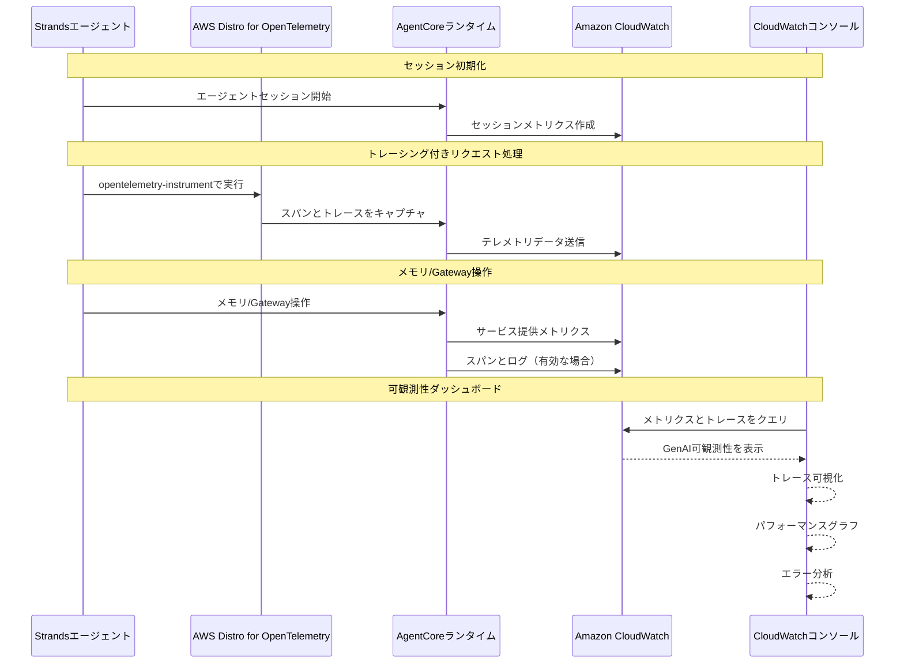

# AgentCore 可観測性統合

[English](README.md) / [日本語](README_ja.md)

この実装では、本番環境でのAIエージェントの包括的な監視、トレース、デバッグのためのAmazon CloudWatch統合を持つ **AgentCore 可観測性** をデモンストレーションします。AgentCoreは、標準化されたOpenTelemetry（OTEL）互換のテレメトリデータを通じて、エージェントのパフォーマンスをリアルタイムで可視化します。

## プロセス概要



## 前提条件

### 1. CloudWatch Transaction Searchの有効化（一度だけのセットアップ）

**オプションA: AgentCoreコンソール経由の自動セットアップ**
- AgentCoreコンソールでメモリリソースを作成する際に、**Enable Observability**ボタンをクリック
- AgentCoreが自動的にTransaction Searchを有効化

**オプションB: CloudWatchコンソール経由の手動セットアップ**
1. [CloudWatchコンソール](https://console.aws.amazon.com/cloudwatch)を開く
2. **Application Signals (APM)** → **Transaction search**に移動
3. **Enable Transaction Search**を選択
4. **ingest spans as structured logs**のチェックボックスを選択
5. （オプション）**X-Ray trace indexing**のパーセンテージを調整（デフォルト: 1%）
6. **Save**を選択

### 2. 必要なAWS権限

AWS認証情報に以下の権限が含まれていることを確認してください：
```json
{
    "Version": "2012-10-17",
    "Statement": [
        {
            "Effect": "Allow",
            "Action": [
                "bedrock-agentcore:*",
                "logs:CreateLogGroup",
                "logs:CreateLogStream",
                "logs:PutLogEvents",
                "logs:DescribeLogGroups",
                "logs:DescribeLogStreams",
                "cloudwatch:PutMetricData",
                "xray:PutTraceSegments",
                "xray:PutTelemetryRecords"
            ],
            "Resource": "*"
        }
    ]
}
```

### 3. メモリリソースのトレーシング有効化

メモリリソースを作成する際に、サービス提供のスパンをキャプチャするためにトレーシングを有効化します：

**コンソール経由:**
- メモリ作成プロセス中にトレーシングを有効化
- AgentCoreがロググループを自動作成するようプロンプト表示

**CLI/SDK経由:**
- CloudWatchロググループを手動設定
- デフォルトロググループ形式: `/aws/bedrock-agentcore/{resource-id}`

### 4. 依存関係のインストール

エージェントの依存関係にADOT SDKとboto3を追加します：

**requirements.txt:**
```txt
aws-opentelemetry-distro>=0.10.0
boto3
strands-agents  # or your preferred agent framework
```

**または直接インストール:**
```bash
pip install aws-opentelemetry-distro>=0.10.0 boto3
```

## 可観測性の概念

### セッション
- **定義**: ユーザーとエージェント間の完全なインタラクションコンテキスト
- **スコープ**: 初期化から終了までの会話全体のライフサイクル
- **提供機能**: コンテキスト永続化、状態管理、会話履歴
- **メトリクス**: セッション数、持続時間、ユーザーエンゲージメントパターン

### トレース
- **定義**: 単一のリクエスト-レスポンスサイクルの詳細記録
- **スコープ**: エージェント呼び出しからレスポンスまでの完全な実行パス
- **提供機能**: 処理ステップ、ツール呼び出し、リソース利用状況
- **メトリクス**: リクエストレイテンシ、処理時間、エラー率

### スパン
- **定義**: 実行フロー内の個別の測定可能な作業単位
- **スコープ**: 開始/終了タイムスタンプ付きの細かい操作
- **提供機能**: 操作詳細、親子関係、ステータス情報
- **メトリクス**: 操作時間、成功/失敗率、リソース使用量

## 組み込み可観測性機能

### AgentCoreランタイム
- **デフォルトメトリクス**: セッション数、レイテンシ、持続時間、トークン使用量、エラー率
- **自動セットアップ**: CloudWatchロググループが自動作成
- **ダッシュボード**: CloudWatch GenAI可観測性ページで利用可能

### メモリリソース
- **デフォルトメトリクス**: メモリ操作、検索パフォーマンス
- **オプションスパン**: 作成時にトレーシングを有効化した場合に利用可能
- **ロググループ**: CLI/SDK作成時は手動設定が必要

### Gatewayリソース
- **デフォルトメトリクス**: Gatewayパフォーマンス、リクエストルーティング
- **カスタムログ**: ユーザー定義ログ出力をサポート
- **手動セットアップ**: CloudWatchロググループの手動設定が必要

### 組み込みツール
- **デフォルトメトリクス**: ツール呼び出しパフォーマンス
- **カスタムログ**: ユーザー定義ログ出力をサポート
- **手動セットアップ**: CloudWatchロググループの手動設定が必要

## 可観測性データの表示

### CloudWatch GenAI可観測性ダッシュボード
アクセス: [CloudWatch GenAI Observability](https://console.aws.amazon.com/cloudwatch/home#gen-ai-observability)

**機能:**
- 実行フロー付きトレース可視化
- パフォーマンスグラフとメトリクス
- エラー分析と分類
- セッションとリクエストの分析
- カスタムスパンメトリクス可視化

### CloudWatchログ
- 生テレメトリデータストレージ
- 構造化ログ形式
- CloudWatch Insights経由のクエリ機能
- AWS CLI/SDK経由のエクスポートオプション

## 参考資料

- [AgentCore可観測性開発者ガイド](https://docs.aws.amazon.com/bedrock-agentcore/latest/devguide/observability.html)
- [CloudWatch GenAI可観測性](https://docs.aws.amazon.com/AmazonCloudWatch/latest/monitoring/GenAI-observability.html)
- [AWS Distro for OpenTelemetry](https://aws-otel.github.io/docs/introduction)
- [GenAI用OpenTelemetryセマンティック規約](https://opentelemetry.io/docs/specs/semconv/gen-ai/)
- [CloudWatch Transaction Search](https://docs.aws.amazon.com/AmazonCloudWatch/latest/monitoring/CloudWatch-Transaction-Search.html)

---

**次のステップ**: AgentCoreアプリケーションで可観測性を有効化し、エージェントのパフォーマンスに関する包括的な洞察を得、問題を効果的にトラブルシュートし、本番デプロイを最適化しましょう。[06_memory](../06_memory/README.md)でエージェントにコンテキスト認識機能を追加して続けてください。
