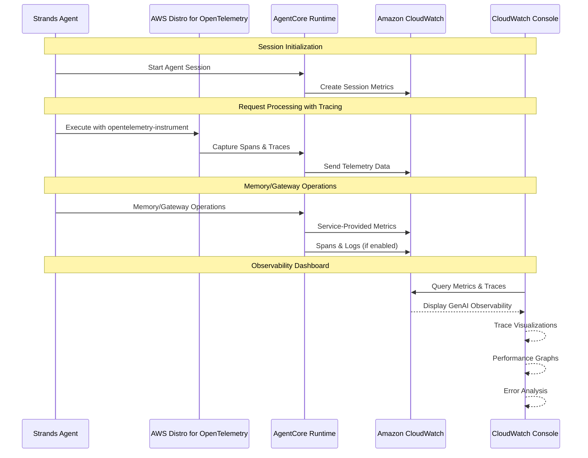

# AgentCore Observability Integration

[English](README.md) / [日本語](README_ja.md)

This implementation demonstrates **AgentCore Observability** with Amazon CloudWatch integration for comprehensive monitoring, tracing, and debugging of AI agents in production environments. AgentCore provides real-time visibility into agent performance through standardized OpenTelemetry (OTEL) compatible telemetry data.

## Process Overview



## Prerequisites

### 1. Enable CloudWatch Transaction Search (One-time Setup)

**Option A: Automatic Setup via AgentCore Console**
- When creating a memory resource in the AgentCore console, click **Enable Observability** button
- AgentCore automatically enables Transaction Search for you

**Option B: Manual Setup via CloudWatch Console**
1. Open the [CloudWatch Console](https://console.aws.amazon.com/cloudwatch)
2. Navigate to **Application Signals (APM)** → **Transaction search**
3. Choose **Enable Transaction Search**
4. Select checkbox to **ingest spans as structured logs**
5. (Optional) Adjust **X-Ray trace indexing** percentage (default: 1%)
6. Choose **Save**

### 2. AWS Permissions Required

Ensure your AWS credentials include the following permissions:
```json
{
    "Version": "2012-10-17",
    "Statement": [
        {
            "Effect": "Allow",
            "Action": [
                "bedrock-agentcore:*",
                "logs:CreateLogGroup",
                "logs:CreateLogStream",
                "logs:PutLogEvents",
                "logs:DescribeLogGroups",
                "logs:DescribeLogStreams",
                "cloudwatch:PutMetricData",
                "xray:PutTraceSegments",
                "xray:PutTelemetryRecords"
            ],
            "Resource": "*"
        }
    ]
}
```

### 3. Enable Tracing for Memory Resources

When creating memory resources, enable tracing to capture service-provided spans:

**Via Console:**
- Enable tracing during memory creation process
- AgentCore prompts you to create log groups automatically

**Via CLI/SDK:**
- Manually configure CloudWatch log groups
- Default log group format: `/aws/bedrock-agentcore/{resource-id}`

### 4. Install Dependencies

Add ADOT SDK and boto3 to your agent dependencies:

**requirements.txt:**
```txt
aws-opentelemetry-distro>=0.10.0
boto3
strands-agents  # or your preferred agent framework
```

**Or install directly:**
```bash
pip install aws-opentelemetry-distro>=0.10.0 boto3
```

## Observability Concepts

### Sessions
- **Definition**: Complete interaction context between user and agent
- **Scope**: Entire conversation lifecycle from initialization to termination
- **Provides**: Context persistence, state management, conversation history
- **Metrics**: Session count, duration, user engagement patterns

### Traces
- **Definition**: Detailed record of single request-response cycle
- **Scope**: Complete execution path from agent invocation to response
- **Provides**: Processing steps, tool invocations, resource utilization
- **Metrics**: Request latency, processing time, error rates

### Spans
- **Definition**: Discrete, measurable unit of work within execution flow
- **Scope**: Fine-grained operations with start/end timestamps
- **Provides**: Operation details, parent-child relationships, status information
- **Metrics**: Operation duration, success/failure rates, resource usage

## Built-in Observability Features

### AgentCore Runtime
- **Default Metrics**: Session count, latency, duration, token usage, error rates
- **Automatic Setup**: CloudWatch log group created automatically
- **Dashboard**: Available in CloudWatch GenAI Observability page

### Memory Resources
- **Default Metrics**: Memory operations, retrieval performance
- **Optional Spans**: Available when tracing is enabled during creation
- **Log Groups**: Manual configuration required for CLI/SDK creation

### Gateway Resources
- **Default Metrics**: Gateway performance, request routing
- **Custom Logs**: Support for user-defined log outputs
- **Manual Setup**: CloudWatch log groups require manual configuration

### Built-in Tools
- **Default Metrics**: Tool invocation performance
- **Custom Logs**: Support for user-defined log outputs
- **Manual Setup**: CloudWatch log groups require manual configuration

## Viewing Observability Data

### CloudWatch GenAI Observability Dashboard
Access via: [CloudWatch GenAI Observability](https://console.aws.amazon.com/cloudwatch/home#gen-ai-observability)

**Features:**
- Trace visualizations with execution flow
- Performance graphs and metrics
- Error breakdowns and analysis
- Session and request analytics
- Custom span metrics visualization

### CloudWatch Logs
- Raw telemetry data storage
- Structured log format
- Query capabilities via CloudWatch Insights
- Export options via AWS CLI/SDKs

## References

- [AgentCore Observability Developer Guide](https://docs.aws.amazon.com/bedrock-agentcore/latest/devguide/observability.html)
- [CloudWatch GenAI Observability](https://docs.aws.amazon.com/AmazonCloudWatch/latest/monitoring/GenAI-observability.html)
- [AWS Distro for OpenTelemetry](https://aws-otel.github.io/docs/introduction)
- [OpenTelemetry Semantic Conventions for GenAI](https://opentelemetry.io/docs/specs/semconv/gen-ai/)
- [CloudWatch Transaction Search](https://docs.aws.amazon.com/AmazonCloudWatch/latest/monitoring/CloudWatch-Transaction-Search.html)

---

**Next Steps**: Enable observability in your AgentCore applications to gain comprehensive insights into agent performance, troubleshoot issues effectively, and optimize production deployments. Continue with [06_memory](../06_memory/README.md) to add context-aware capabilities to your agents.
