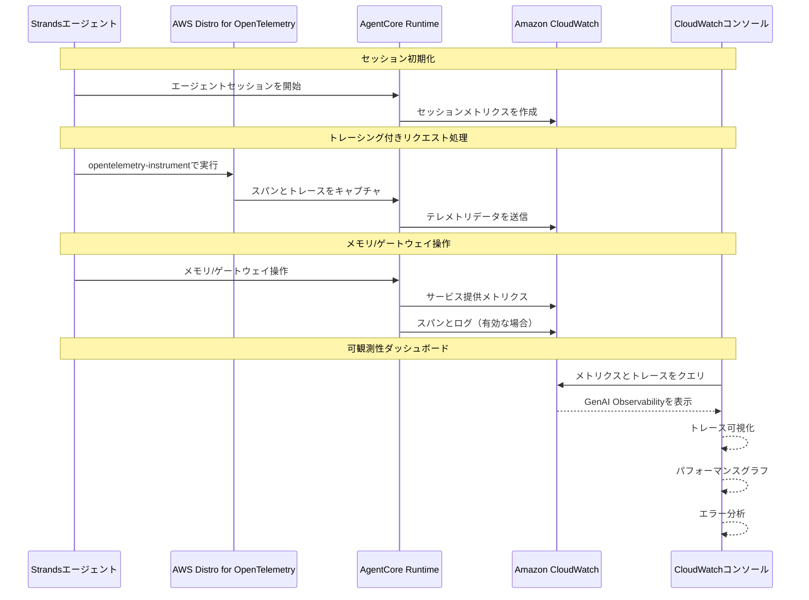

# AgentCore Observability統合

[English](README.md) / [日本語](README_ja.md)

この実装では、本番環境でのAIエージェントの包括的なモニタリング、トレーシング、デバッグのためのAmazon CloudWatch統合を備えた **AgentCore Observability** を実演します。AgentCoreは、標準化されたOpenTelemetry（OTEL）互換のテレメトリデータを通じて、エージェントパフォーマンスへのリアルタイムの可視性を提供します。

## プロセス概要



## 前提条件

### 1. CloudWatchトランザクション検索を有効化（初回セットアップ）

**オプションA: AgentCoreコンソール経由の自動セットアップ**
- AgentCoreコンソールでメモリリソースを作成する際、**Enable Observability**ボタンをクリック
- AgentCoreが自動的にトランザクション検索を有効化

**オプションB: CloudWatchコンソール経由の手動セットアップ**
1. [CloudWatchコンソール](https://console.aws.amazon.com/cloudwatch)を開く
2. **Application Signals (APM)** → **Transaction search**に移動
3. **Enable Transaction Search**を選択
4. **構造化ログとしてスパンを取り込む**チェックボックスを選択
5. （オプション）**X-Rayトレースインデックス**の割合を調整（デフォルト：1%）
6. **保存**を選択

### 2. 必要なAWS権限

AWS認証情報に以下の権限が含まれていることを確認してください：
```json
{
    "Version": "2012-10-17",
    "Statement": [
        {
            "Effect": "Allow",
            "Action": [
                "bedrock-agentcore:*",
                "logs:CreateLogGroup",
                "logs:CreateLogStream",
                "logs:PutLogEvents",
                "logs:DescribeLogGroups",
                "logs:DescribeLogStreams",
                "cloudwatch:PutMetricData",
                "xray:PutTraceSegments",
                "xray:PutTelemetryRecords"
            ],
            "Resource": "*"
        }
    ]
}
```

### 3. メモリリソースのトレーシングを有効化

メモリリソースを作成する際、サービス提供のスパンをキャプチャするためトレーシングを有効化：

**コンソール経由：**
- メモリ作成プロセス中にトレーシングを有効化
- AgentCoreが自動的にログループの作成を促す

**CLI/SDK経由：**
- CloudWatchログループを手動で設定
- デフォルトのログループ形式：`/aws/bedrock-agentcore/{resource-id}`

### 4. 依存関係をインストール

エージェントの依存関係にADOT SDKとboto3を追加：

**requirements.txt：**
```txt
aws-opentelemetry-distro>=0.10.0
boto3
strands-agents  # または好みのエージェントフレームワーク
```

**または直接インストール：**
```bash
pip install aws-opentelemetry-distro>=0.10.0 boto3
```

## 可観測性の概念

### セッション
- **定義**: ユーザーとエージェント間の完全なインタラクションコンテキスト
- **スコープ**: 初期化から終了までの会話のライフサイクル全体
- **提供内容**: コンテキストの永続性、状態管理、会話履歴
- **メトリクス**: セッション数、継続時間、ユーザーエンゲージメントパターン

### トレース
- **定義**: 単一のリクエスト-レスポンスサイクルの詳細な記録
- **スコープ**: エージェント呼び出しからレスポンスまでの完全な実行パス
- **提供内容**: 処理ステップ、ツール呼び出し、リソース使用率
- **メトリクス**: リクエストレイテンシ、処理時間、エラー率

### スパン
- **定義**: 実行フロー内の離散的で測定可能な作業単位
- **スコープ**: 開始/終了タイムスタンプを持つ細かい操作
- **提供内容**: 操作の詳細、親子関係、ステータス情報
- **メトリクス**: 操作期間、成功/失敗率、リソース使用量

## 組み込み可観測性機能

### AgentCore Runtime
- **デフォルトメトリクス**: セッション数、レイテンシ、継続時間、トークン使用量、エラー率
- **自動セットアップ**: CloudWatchログループが自動的に作成される
- **ダッシュボード**: CloudWatch GenAI Observabilityページで利用可能

### メモリリソース
- **デフォルトメトリクス**: メモリ操作、取得パフォーマンス
- **オプションのスパン**: 作成時にトレーシングが有効な場合に利用可能
- **ログループ**: CLI/SDK作成には手動設定が必要

### ゲートウェイリソース
- **デフォルトメトリクス**: ゲートウェイパフォーマンス、リクエストルーティング
- **カスタムログ**: ユーザー定義のログ出力をサポート
- **手動セットアップ**: CloudWatchログループは手動設定が必要

### 組み込みツール
- **デフォルトメトリクス**: ツール呼び出しパフォーマンス
- **カスタムログ**: ユーザー定義のログ出力をサポート
- **手動セットアップ**: CloudWatchログループは手動設定が必要

## 可観測性データの表示

### CloudWatch GenAI Observabilityダッシュボード
アクセス方法：[CloudWatch GenAI Observability](https://console.aws.amazon.com/cloudwatch/home#gen-ai-observability)

**機能：**
- 実行フローを含むトレース可視化
- パフォーマンスグラフとメトリクス
- エラーの内訳と分析
- セッションとリクエスト分析
- カスタムスパンメトリクスの可視化

### CloudWatchログ
- 生のテレメトリデータストレージ
- 構造化されたログ形式
- CloudWatch Insightsによるクエリ機能
- AWS CLI/SDKによるエクスポートオプション

## 参考資料

- [AgentCore Observability開発者ガイド](https://docs.aws.amazon.com/bedrock-agentcore/latest/devguide/observability.html)
- [CloudWatch GenAI Observability](https://docs.aws.amazon.com/AmazonCloudWatch/latest/monitoring/GenAI-observability.html)
- [AWS Distro for OpenTelemetry](https://aws-otel.github.io/docs/introduction)
- [GenAI向けOpenTelemetryセマンティック規約](https://opentelemetry.io/docs/specs/semconv/gen-ai/)
- [CloudWatchトランザクション検索](https://docs.aws.amazon.com/AmazonCloudWatch/latest/monitoring/CloudWatch-Transaction-Search.html)

---

**次のステップ**: AgentCoreアプリケーションで可観測性を有効にして、エージェントパフォーマンスへの包括的な洞察を得て、効果的に問題をトラブルシューティングし、本番デプロイメントを最適化しましょう。