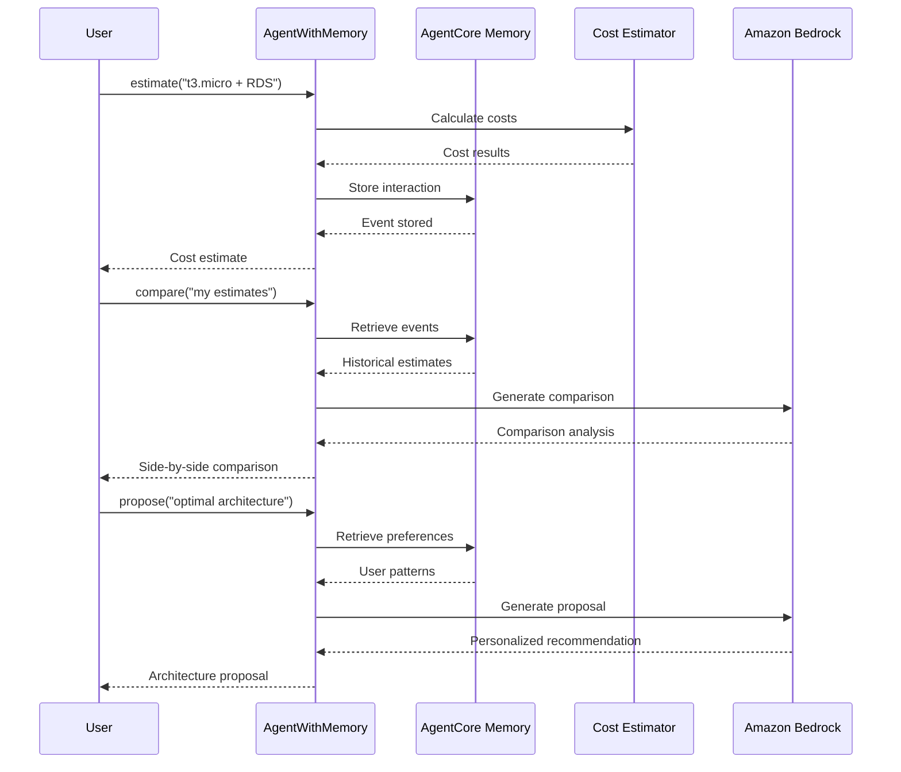

# AgentCore Memory Integration

[English](README.md) / [日本語](README_ja.md)

This implementation demonstrates **AgentCore Memory** capabilities by enhancing the AWS Cost Estimator with both short-term and long-term memory features. The `AgentWithMemory` class provides practical examples of memory usage patterns for cost estimation, comparison, and personalized recommendations.

## Process Overview



## Prerequisites

1. **Cost Estimator deployed** - Complete `01_code_interpreter` setup first
2. **AWS credentials** - With `bedrock-agentcore-control` and `bedrock:InvokeModel` permissions
3. **Dependencies** - Installed via `uv` (see pyproject.toml)

## How to use

### File Structure

```
06_memory/
├── README.md                      # This documentation
└── test_memory.py                 # Main implementation and test suite
```

### Step 1: Run with Existing Memory (Fast)

```bash
cd 06_memory
uv run python test_memory.py
```

This will reuse existing memory for faster debugging and testing.

### Step 2: Force Recreation (Clean Start)

```bash
cd 06_memory
uv run python test_memory.py --force
```

This will delete existing memory and create a fresh instance for clean testing.

## Key Implementation Patterns

### Memory-Enhanced Agent

```python
class AgentWithMemory:
    def __init__(self, actor_id: str, region: str = "us-west-2", force_recreate: bool = False):
        # Initialize AgentCore Memory with user preference strategy
        self.memory = self.memory_client.create_memory_and_wait(
            name="cost_estimator_memory",
            strategies=[{
                "userPreferenceMemoryStrategy": {
                    "name": "UserPreferenceExtractor",
                    "description": "Extracts user preferences for AWS architecture decisions",
                    "namespaces": [f"/preferences/{self.actor_id}"]
                }
            }],
            event_expiry_days=7,
        )
```

### Context Manager Pattern

```python
# Ensures proper resource management
with AgentWithMemory(actor_id="user123") as agent:
    # All operations happen within this context
    result = agent("estimate architecture: t3.micro + RDS")
    comparison = agent("compare my estimates")
    proposal = agent("propose optimal architecture")
# Memory is preserved for reuse (use --force to recreate)
```

### Memory Storage Pattern

```python
@tool
def estimate(self, architecture_description: str) -> str:
    # Generate cost estimate
    result = cost_estimator.estimate_costs(architecture_description)
    
    # Store interaction in memory for future comparison
    self.memory_client.create_event(
        memory_id=self.memory_id,
        actor_id=self.actor_id,
        session_id=self.session_id,
        messages=[
            (architecture_description, "USER"),
            (result, "ASSISTANT")
        ]
    )
    return result
```

## Memory Types Demonstrated

### Short-term Memory (Session Context)
- **Purpose**: Store multiple estimates within a session for immediate comparison
- **Implementation**: Uses `list_events()` to retrieve recent interactions
- **Use Case**: Compare 3 different EC2 instance types side-by-side

### Long-term Memory (User Preferences)
- **Purpose**: Learn user decision patterns and preferences over time
- **Implementation**: Uses `retrieve_memories()` with user preference strategy
- **Use Case**: Recommend architectures based on historical choices

## Usage Examples

### Basic Cost Estimation with Memory

```python
from test_memory import AgentWithMemory

with AgentWithMemory(actor_id="user123") as agent:
    # Generate multiple estimates
    result1 = agent("estimate: t3.micro + RDS MySQL")
    result2 = agent("estimate: t3.small + RDS MySQL") 
    result3 = agent("estimate: t3.medium + RDS MySQL")
    
    # Compare all estimates
    comparison = agent("compare my recent estimates")
    
    # Get personalized recommendation
    proposal = agent("propose optimal architecture for my needs")
```

### Memory Inspection for Debugging

```python
with AgentWithMemory(actor_id="user123") as agent_wrapper:
    # Access the underlying AgentWithMemory instance
    memory_agent = agent_wrapper
    
    # Inspect stored events
    events = memory_agent.list_memory_events(max_results=5)
    print(f"Found {len(events)} events in memory")
```

## Memory Benefits

- **Session Continuity** - Compare multiple estimates within the same session
- **Learning Capability** - Agent learns user preferences over time
- **Personalized Recommendations** - Proposals based on historical patterns
- **Cost Optimization** - Memory reuse reduces initialization time
- **Debugging Support** - Event inspection for troubleshooting

## References

- [AgentCore Memory Developer Guide](https://docs.aws.amazon.com/bedrock-agentcore/latest/devguide/memory.html)
- [Memory Strategies Documentation](https://docs.aws.amazon.com/bedrock-agentcore/latest/devguide/memory-strategies.html)
- [Amazon Bedrock Converse API](https://docs.aws.amazon.com/bedrock/latest/userguide/conversation-inference.html)
- [Strands Agents Documentation](https://github.com/aws-samples/strands-agents)

---

**Next Steps**: Integrate memory-enhanced agents into your applications to provide personalized, context-aware user experiences.
