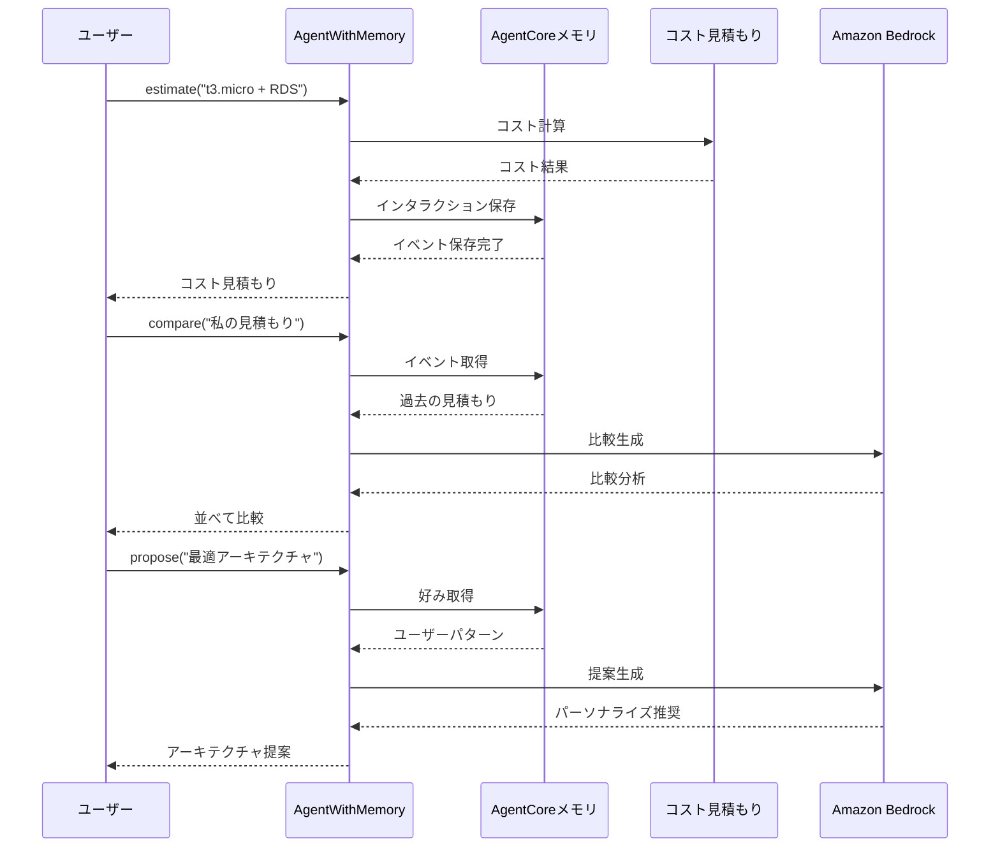

# AgentCore メモリ統合

[English](README.md) / [日本語](README_ja.md)

この実装では、AWSコスト見積もりに短期メモリと長期メモリの両方の機能を追加することで、**AgentCore メモリ** 機能をデモンストレーションします。`AgentWithMemory` クラスは、コスト見積もり、比較、パーソナライズされた推奨事項のためのメモリ使用パターンの実用的な例を提供します。

## プロセス概要



## 前提条件

1. **コスト見積もりのデプロイ** - まず `01_code_interpreter` のセットアップを完了
2. **AWS認証情報** - `bedrock-agentcore-control` と `bedrock:InvokeModel` 権限付き
3. **依存関係** - `uv` 経由でインストール (pyproject.tomlを参照)

## 使用方法

### ファイル構成

```
06_memory/
├── README.md                      # このドキュメント
└── test_memory.py                 # メイン実装とテストスイート
```

### ステップ 1: 既存メモリで実行（高速）

```bash
cd 06_memory
uv run python test_memory.py
```

これは既存のメモリを再利用して、より高速なデバッグとテストを実現します。

### ステップ 2: 強制再作成（クリーンスタート）

```bash
cd 06_memory
uv run python test_memory.py --force
```

これは既存のメモリを削除し、クリーンなテストのために新しいインスタンスを作成します。

## 主要な実装パターン

### メモリ強化エージェント

```python
class AgentWithMemory:
    def __init__(self, actor_id: str, region: str = "us-west-2", force_recreate: bool = False):
        # ユーザー設定戦略でAgentCoreメモリを初期化
        self.memory = self.memory_client.create_memory_and_wait(
            name="cost_estimator_memory",
            strategies=[{
                "userPreferenceMemoryStrategy": {
                    "name": "UserPreferenceExtractor",
                    "description": "Extracts user preferences for AWS architecture decisions",
                    "namespaces": [f"/preferences/{self.actor_id}"]
                }
            }],
            event_expiry_days=7,
        )
```

### コンテキストマネージャーパターン

```python
# 適切なリソース管理を確実に
with AgentWithMemory(actor_id="user123") as agent:
    # すべての操作はこのコンテキスト内で実行
    result = agent("estimate architecture: t3.micro + RDS")
    comparison = agent("compare my estimates")
    proposal = agent("propose optimal architecture")
# メモリは再利用のために保持（--forceで再作成）
```

### メモリストレージパターン

```python
@tool
def estimate(self, architecture_description: str) -> str:
    # コスト見積もりを生成
    result = cost_estimator.estimate_costs(architecture_description)
    
    # 将来の比較のためにインタラクションをメモリに保存
    self.memory_client.create_event(
        memory_id=self.memory_id,
        actor_id=self.actor_id,
        session_id=self.session_id,
        messages=[
            (architecture_description, "USER"),
            (result, "ASSISTANT")
        ]
    )
    return result
```

## デモンストレーションされるメモリタイプ

### 短期メモリ（セッションコンテキスト）
- **目的**: 即座比較のためにセッション内で複数の見積もりを保存
- **実装**: `list_events()` を使用して最近のインタラクションを取得
- **使用例**: 3つの異なるEC2インスタンスタイプを並べて比較

### 長期メモリ（ユーザー設定）
- **目的**: 時間をかけてユーザーの意思決定パターンと好みを学習
- **実装**: ユーザー設定戦略で `retrieve_memories()` を使用
- **使用例**: 過去の選択に基づいてアーキテクチャを推奨

## 使用例

### メモリ付き基本コスト見積もり

```python
from test_memory import AgentWithMemory

with AgentWithMemory(actor_id="user123") as agent:
    # 複数の見積もりを生成
    result1 = agent("estimate: t3.micro + RDS MySQL")
    result2 = agent("estimate: t3.small + RDS MySQL") 
    result3 = agent("estimate: t3.medium + RDS MySQL")
    
    # すべての見積もりを比較
    comparison = agent("compare my recent estimates")
    
    # パーソナライズされた推奨を取得
    proposal = agent("propose optimal architecture for my needs")
```

### デバッグ用メモリ検査

```python
with AgentWithMemory(actor_id="user123") as agent_wrapper:
    # 基礎となるAgentWithMemoryインスタンスにアクセス
    memory_agent = agent_wrapper
    
    # 保存されたイベントを検査
    events = memory_agent.list_memory_events(max_results=5)
    print(f"Found {len(events)} events in memory")
```

## メモリのメリット

- **セッション継続性** - 同一セッション内で複数の見積もりを比較
- **学習機能** - エージェントが時間をかけてユーザーの好みを学習
- **パーソナライズされた推奨** - 過去のパターンに基づいた提案
- **コスト最適化** - メモリの再利用で初期化時間を短縮
- **デバッグサポート** - トラブルシューティング用のイベント検査

## 参考資料

- [AgentCoreメモリ開発者ガイド](https://docs.aws.amazon.com/bedrock-agentcore/latest/devguide/memory.html)
- [メモリ戦略ドキュメント](https://docs.aws.amazon.com/bedrock-agentcore/latest/devguide/memory-strategies.html)
- [Amazon Bedrock Converse API](https://docs.aws.amazon.com/bedrock/latest/userguide/conversation-inference.html)
- [Strands Agentsドキュメント](https://github.com/aws-samples/strands-agents)

---

**次のステップ**: メモリ強化エージェントをアプリケーションに統合し、パーソナライズされたコンテキスト認識ユーザーエクスペリエンスを提供しましょう。
