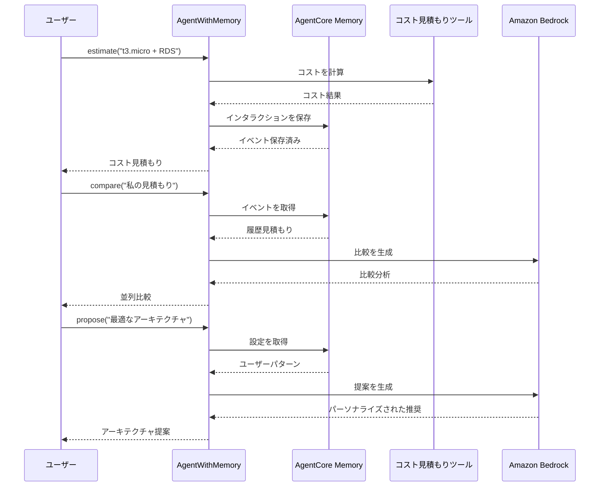

# AgentCore Memory統合

[English](README.md) / [日本語](README_ja.md)

この実装では、短期および長期メモリ機能の両方でAWSコスト見積もりツールを強化する **AgentCore Memory** 機能を実演します。`AgentWithMemory`クラスは、コスト見積もり、比較、パーソナライズされた推奨のためのメモリ使用パターンの実践的な例を提供します。

## プロセス概要



## 前提条件

1. **コスト見積もりツールデプロイ済み** - まず`01_code_interpreter`セットアップを完了
2. **AWS認証情報** - `bedrock-agentcore-control`と`bedrock:InvokeModel`権限付き
3. **依存関係** - `uv`経由でインストール（pyproject.toml参照）

## 使用方法

### ファイル構成

```
06_memory/
├── README.md                      # このドキュメント
└── test_memory.py                 # メイン実装とテストスイート
```

### ステップ1: 既存のメモリで実行（高速）

```bash
cd 06_memory
uv run python test_memory.py
```

これにより、より高速なデバッグとテストのために既存のメモリが再利用されます。

### ステップ2: 強制再作成（クリーンスタート）

```bash
cd 06_memory
uv run python test_memory.py --force
```

これにより、既存のメモリが削除され、クリーンなテストのために新しいインスタンスが作成されます。

## 主要な実装パターン

### メモリ拡張エージェント

```python
class AgentWithMemory:
    def __init__(self, actor_id: str, region: str = "us-west-2", force_recreate: bool = False):
        # ユーザー設定戦略でAgentCore Memoryを初期化
        self.memory = self.memory_client.create_memory_and_wait(
            name="cost_estimator_memory",
            strategies=[{
                "userPreferenceMemoryStrategy": {
                    "name": "UserPreferenceExtractor",
                    "description": "AWSアーキテクチャ決定のためのユーザー設定を抽出",
                    "namespaces": [f"/preferences/{self.actor_id}"]
                }
            }],
            event_expiry_days=7,
        )
```

### コンテキストマネージャーパターン

```python
# 適切なリソース管理を保証
with AgentWithMemory(actor_id="user123") as agent:
    # すべての操作はこのコンテキスト内で実行
    result = agent("アーキテクチャを見積もり: t3.micro + RDS")
    comparison = agent("私の見積もりを比較")
    proposal = agent("最適なアーキテクチャを提案")
# メモリは再利用のために保持される（再作成には--forceを使用）
```

### メモリストレージパターン

```python
@tool
def estimate(self, architecture_description: str) -> str:
    # コスト見積もりを生成
    result = cost_estimator.estimate_costs(architecture_description)
    
    # 将来の比較のためにメモリにインタラクションを保存
    self.memory_client.create_event(
        memory_id=self.memory_id,
        actor_id=self.actor_id,
        session_id=self.session_id,
        messages=[
            (architecture_description, "USER"),
            (result, "ASSISTANT")
        ]
    )
    return result
```

## 実演されるメモリタイプ

### 短期メモリ（セッションコンテキスト）
- **目的**: 即座の比較のためにセッション内で複数の見積もりを保存
- **実装**: `list_events()`を使用して最近のインタラクションを取得
- **ユースケース**: 3つの異なるEC2インスタンスタイプを並列比較

### 長期メモリ（ユーザー設定）
- **目的**: 時間の経過とともにユーザーの決定パターンと設定を学習
- **実装**: ユーザー設定戦略で`retrieve_memories()`を使用
- **ユースケース**: 履歴の選択に基づいてアーキテクチャを推奨

## 使用例

### メモリ付き基本コスト見積もり

```python
from test_memory import AgentWithMemory

with AgentWithMemory(actor_id="user123") as agent:
    # 複数の見積もりを生成
    result1 = agent("見積もり: t3.micro + RDS MySQL")
    result2 = agent("見積もり: t3.small + RDS MySQL") 
    result3 = agent("見積もり: t3.medium + RDS MySQL")
    
    # すべての見積もりを比較
    comparison = agent("最近の見積もりを比較")
    
    # パーソナライズされた推奨を取得
    proposal = agent("私のニーズに最適なアーキテクチャを提案")
```

### デバッグのためのメモリ検査

```python
with AgentWithMemory(actor_id="user123") as agent_wrapper:
    # 基礎となるAgentWithMemoryインスタンスにアクセス
    memory_agent = agent_wrapper
    
    # 保存されたイベントを検査
    events = memory_agent.list_memory_events(max_results=5)
    print(f"メモリに{len(events)}個のイベントが見つかりました")
```

## メモリの利点

- **セッションの継続性** - 同じセッション内で複数の見積もりを比較
- **学習能力** - エージェントは時間とともにユーザーの好みを学習
- **パーソナライズされた推奨** - 履歴パターンに基づく提案
- **コスト最適化** - メモリの再利用により初期化時間を削減
- **デバッグサポート** - トラブルシューティングのためのイベント検査

## 参考資料

- [AgentCore Memory開発者ガイド](https://docs.aws.amazon.com/bedrock-agentcore/latest/devguide/memory.html)
- [メモリ戦略ドキュメント](https://docs.aws.amazon.com/bedrock-agentcore/latest/devguide/memory-strategies.html)
- [Amazon Bedrock Converse API](https://docs.aws.amazon.com/bedrock/latest/userguide/conversation-inference.html)
- [Strands Agentsドキュメント](https://github.com/aws-samples/strands-agents)

---

**次のステップ**: パーソナライズされたコンテキスト認識のユーザー体験を提供するために、メモリ拡張エージェントをアプリケーションに統合しましょう。